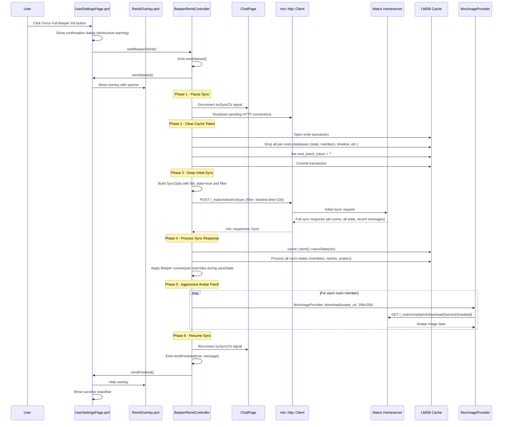
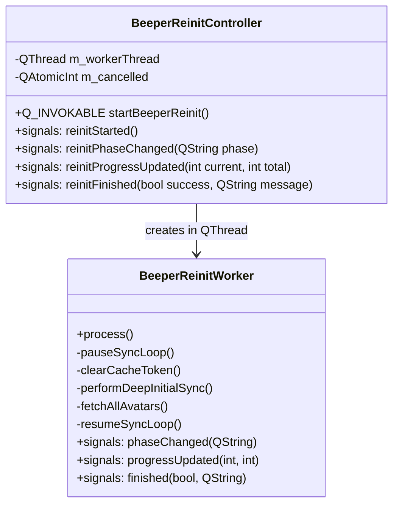

# Beeper Full Re-Init — Architectural Plan

> **STATUS: 🔵 PLANNING — Awaiting user review and approval**

## Overview

This feature adds a "Force Full Beeper Init" capability — a destructive, deep rebuild of the account's state, history, and avatars. It mimics the initial heavy sync and cache build performed by the official Beeper client. The user triggers it from a prominent red/destructive button in UserSettingsPage.

Unlike the existing `CacheRefreshController` (which only refreshes display names and downloads avatars for existing rooms without touching the sync state), this feature:

1. **Pauses** the running sync loop safely
2. **Clears** the `next_batch` sync token (forces a full initial sync)
3. **Drops** all per-room LMDB databases (timeline, state, members, etc.)
4. **Triggers** a deep initial `/sync` with high timeline limits
5. **Ensures** Beeper counterpart overrides are applied during the rebuild
6. **Aggressively fetches** all member avatars into the media cache

---

## Architecture Diagram



---

## Component Design

### 1. BeeperReinitController (New C++ Backend)

Reuses the same architectural pattern as `CacheRefreshController` (QThread + Worker, QML_SINGLETON), but with fundamentally different logic:



**Key Design Decisions:**

- **Separate class from CacheRefreshController**: The re-init has fundamentally different semantics (destructive token clear + initial sync vs. profile refresh). Keeping them separate avoids complexity and makes each class single-purpose.
- **Phase-based progress reporting**: Unlike the simple current/total of CacheRefreshController, the re-init reports phases: "Pausing sync...", "Clearing cache...", "Performing initial sync...", "Downloading avatars...", "Resuming sync...". This gives better UX feedback for a potentially long operation.
- **ChatPage friend access**: The controller needs to call `ChatPage` methods to pause/resume the sync loop. This requires either a friend declaration or public methods on `ChatPage`.

---

### 2. Safe Cache Reset & Token Clearing

The cache reset follows the proven pattern from the `"2021.08.22"` migration in [`Cache.cpp:1731-1772`](nheko/src/Cache.cpp:1731):

```cpp
// In BeeperReinitWorker::clearCacheToken():
auto txn = lmdb::txn::begin(cache->env(), nullptr);
auto try_drop = [&txn](const std::string &dbName) {
    try {
        lmdb::dbi::open(txn, dbName.c_str()).drop(txn, true);
    } catch (std::exception &e) {
        nhlog::db()->warn("Failed to drop '{}': {}", dbName, e.what());
    }
};

auto room_ids = cache->getRoomIds(txn);
for (const auto &room : room_ids) {
    try_drop(room + "/state");
    try_drop(room + "/state_by_key");
    try_drop(room + "/account_data");
    try_drop(room + "/members");
    try_drop(room + "/mentions");
    try_drop(room + "/events");
    try_drop(room + "/event_order");
    try_drop(room + "/event2order");
    try_drop(room + "/msg2order");
    try_drop(room + "/order2msg");
    try_drop(room + "/pending");
    try_drop(room + "/related");
}

// Clear room list but don't delete the dbi
cache->roomsDb().drop(txn, false);
// Reset the sync token — this is the key trigger
cache->setNextBatchToken(txn, "");
txn.commit();
```

**What we do NOT clear (preserved across re-init):**
- Olm account keys (`olm_account` in `sync_state`)
- Megolm session databases (inbound/outbound session keys)
- Encrypted rooms list
- `sync_state` database itself (only the `next_batch` key is reset)
- User settings / QSettings

This ensures encryption keys survive the re-init; only room metadata and timeline data are rebuilt.

**Sync pause mechanism:**

```cpp
// In BeeperReinitWorker::pauseSyncLoop():
// 1. Shutdown pending HTTP connections to abort any in-flight sync
http::client()->shutdown();
// 2. Post a call to ChatPage to disconnect its sync signal
QMetaObject::invokeMethod(
    ChatPage::instance(),
    [](ChatPage *cp) {
        QObject::disconnect(cp, &ChatPage::trySyncCb, nullptr, nullptr);
    },
    Qt::BlockingQueuedConnection);
```

**Sync resume mechanism:**

```cpp
// After re-init completes:
QMetaObject::invokeMethod(
    ChatPage::instance(),
    [](ChatPage *cp) {
        QObject::connect(cp, &ChatPage::newSyncResponse,
                         cp, &ChatPage::startRemoveFallbackKeyTimer);
        emit cp->trySyncCb();  // Resume the normal sync loop
    },
    Qt::BlockingQueuedConnection);
```

---

### 3. Deep Initial Sync (/sync parameters)

The standard Nheko initial sync in [`ChatPage::startInitialSync()`](nheko/src/ChatPage.cpp:707) uses:

```cpp
mtx::http::SyncOpts opts;
opts.timeout = 0;
opts.set_presence = currentPresence();
```

For the Beeper re-init, we need to check whether mtxclient's `SyncOpts` supports a `filter` field. Based on the mtxclient API (version used by this Nheko commit), `SyncOpts` likely has:

```cpp
struct SyncOpts {
    std::string since;           // next_batch token
    int timeout = 30000;         // long-poll timeout in ms
    std::string filter;          // filter ID or JSON filter body
    bool full_state = false;     // request full state regardless of since
    mtx::presence::PresenceState set_presence;
};
```

**Re-init sync options:**

```cpp
mtx::http::SyncOpts opts;
opts.timeout = 0;          // No long-poll; complete immediately
opts.full_state = true;    // Force full state for all rooms
// opts.since is left empty (initial sync, not incremental)

// Build a filter that requests more timeline messages per room
nlohmann::json filter = {
    {"room", {
        {"timeline", {
            {"limit", 100}  // Fetch up to 100 recent events per room
        }},
        {"state", {
            {"lazy_load_members", true}  // Use lazy-loaded members
        }}
    }}
};
opts.filter = filter.dump();
```

**IMPORTANT CAVEAT:** The `filter` field and `full_state` field availability depend on the exact mtxclient version used. If the bundled mtxclient doesn't expose `filter` or `full_state` in `SyncOpts`:

**Fallback approach:** Use the existing `startInitialSync()` directly (it already does a full initial sync since `opts.since` is empty). The server will naturally return all rooms with their full state. The `timeline.limit` in the filter affects how many recent messages are included — without it, the server default (typically 10) is used.

To maximize timeline messages without filter support, the worker can additionally call `GET /_matrix/client/v3/rooms/{roomId}/messages` for each room after the sync completes, requesting the most recent 100 messages. This achieves the same "fast-scroll without pagination" goal.

---

### 4. Beeper Custom Naming & Avatar Hook During Rebuild

The existing Beeper counterpart logic is already baked into [`Cache::getRoomName()`](nheko/src/Cache.cpp:3417) and [`Cache::getRoomAvatarUrl()`](nheko/src/Cache.cpp:3364) via patch 0001. These functions are called during `saveState()` → `saveInvites()` and during `RoomInfo` calculations.

**During re-init, the override is automatically applied because:**

1. The sync response is processed via `cache::client()->saveState(res)` — the same code path as normal sync.
2. `saveState()` calls `saveInvites()` and processes each room's state events.
3. When `RoomInfo` is calculated, `getRoomName()` and `getRoomAvatarUrl()` internally check for Beeper fake DMs (3 members, one bot) and return the real counterpart's name/avatar.

**Additional enforcement during the re-init avatar fetch phase:**

After the initial sync completes and all `MemberInfo` records are written to LMDB, the worker iterates all rooms and explicitly re-checks the Beeper counterpart logic:

```cpp
// In BeeperReinitWorker::fetchAllAvatars():
for (const auto &room_id : room_ids) {
    auto txn = lmdb::txn::begin(cache->env(), nullptr, MDB_RDONLY);
    auto membersdb = cache->openMembersDb(txn, room_id);
    auto total = membersdb.size(txn);

    if (total == 3) {
        // This might be a Beeper fake DM — check
        std::map<std::string, MemberInfo> members;
        // ... populate members ...
        const auto *cp = beeperFakeDmCounterpart(members,
                                                  cache->localUserId().toStdString());
        if (cp) {
            // Force-download the real contact's avatar at high resolution
            if (!cp->avatar_url.empty()) {
                QString mxcId = QString::fromStdString(cp->avatar_url);
                mxcId.remove(QStringLiteral("mxc://"));
                MxcImageProvider::download(mxcId, QSize(256, 256),
                    [](QString, QSize, QImage, QString) {});
            }
        }
    }
    txn.abort();
}
```

This ensures the real counterpart avatar is aggressively pre-cached even if the server-side state hasn't fully propagated yet.

---

### 5. LMDB Transaction Safety

**Concurrency considerations:**

- The main sync loop (`ChatPage::trySync` → `handleSyncResponse`) writes to LMDB via `cache::client()->saveState(res)`.
- During re-init, we pause the sync loop BEFORE opening any LMDB write transactions.
- The `http::client()->shutdown()` call aborts any in-flight sync HTTP request, preventing callbacks from firing after the pause.

**Transaction ordering:**

```
1. shutdown() HTTP client     — abort in-flight requests
2. disconnect trySyncCb       — prevent new sync attempts
3. lmdb::txn::begin(env)      — open write txn (blocks other writers via LMDB's MDB_WRITEMAP)
4. Drop per-room databases     — inside the single write txn
5. setNextBatchToken(txn, "")  — inside the same write txn
6. txn.commit()                — atomically apply all changes
7. Perform initial sync        — HTTP call (no LMDB contention)
8. cache::saveState(res)       — writes the new state (normal LMDB txn)
9. reconnect trySyncCb          — resume normal operation
```

**Crash safety:** LMDB's MVCC ensures that if the process crashes mid-re-init, the database is either in the pre-clear or post-clear state (atomic commit). The `next_batch_token` being empty after commit means the next startup will naturally perform a full initial sync — the same recovery path as a fresh install.

---

### 6. QML Overlay (ReinitOverlay.qml)

Similar to the existing [`CacheRefreshOverlay.qml`](patches/new-files/resources/qml/ui/CacheRefreshOverlay.qml) but with phase-aware UI:

```qml
Rectangle {
    id: root
    anchors.fill: parent
    color: Qt.rgba(0, 0, 0, 0.6)
    z: 9999
    visible: inProgress

    MouseArea {
        anchors.fill: parent
        // Block all interaction during re-init
    }

    ColumnLayout {
        anchors.centerIn: parent
        spacing: Nheko.paddingLarge

        BusyIndicator {
            running: root.inProgress
            Layout.alignment: Qt.AlignHCenter
        }

        Label {
            text: root.currentPhase
            color: "white"
            font.pointSize: fontMetrics.font.pointSize * 1.1
        }

        ProgressBar {
            from: 0
            to: Math.max(1, root.progressTotal)
            value: root.progressCurrent
            indeterminate: root.progressTotal === 0
        }

        Label {
            text: qsTr("This may take several minutes. Please do not close Nheko.")
            color: Qt.rgba(1, 1, 1, 0.7)
            font.pointSize: fontMetrics.font.pointSize * 0.85
        }
    }

    Connections {
        target: BeeperReinitController
        function onReinitStarted() {
            root.inProgress = true;
        }
        function onReinitPhaseChanged(phase) {
            root.currentPhase = phase;
        }
        function onReinitProgressUpdated(current, total) {
            root.progressCurrent = current;
            root.progressTotal = total;
        }
        function onReinitFinished(success, message) {
            root.inProgress = false;
        }
    }
}
```

---

### 7. UI Trigger: Destructive Button in UserSettingsPage.qml

Added near the existing "Force Cache Sync" button, styled with destructive colors (red/orange):

```qml
// --- Force Full Beeper Init section ---
Rectangle {
    Layout.fillWidth: true
    Layout.preferredHeight: beeperReinitRow.implicitHeight + Nheko.paddingLarge * 2
    color: Qt.rgba(1, 0, 0, 0.08)  // subtle red tint
    radius: 8
    border.color: Nheko.theme.error
    border.width: 1

    ColumnLayout {
        id: beeperReinitRow
        anchors.centerIn: parent
        spacing: Nheko.paddingSmall

        Label {
            Layout.alignment: Qt.AlignHCenter
            color: Nheko.theme.error
            font.pointSize: fontMetrics.font.pointSize * 0.9
            text: qsTr("Warning: This will delete all cached room data and rebuild from scratch. Use only if chat names/avatars are incorrect.")
            horizontalAlignment: Text.AlignHCenter
            wrapMode: Text.WordWrap
            Layout.fillWidth: true
            Layout.maximumWidth: 400
        }

        Button {
            Layout.alignment: Qt.AlignHCenter
            implicitWidth: 240
            implicitHeight: 44
            text: qsTr("Force Full Beeper Init")

            contentItem: Label {
                color: "white"
                font.bold: true
                text: parent.text
                horizontalAlignment: Text.AlignHCenter
                verticalAlignment: Text.AlignVCenter
            }

            background: Rectangle {
                color: parent.hovered ? Qt.darker("#d32f2f", 1.1) : "#d32f2f"
                radius: 6
            }

            onClicked: {
                confirmReinitDialog.open();
            }
        }
    }
}

Dialog {
    id: confirmReinitDialog
    title: qsTr("Confirm Full Re-Init")
    standardButtons: Dialog.Ok | Dialog.Cancel
    modal: true

    ColumnLayout {
        Label {
            text: qsTr("Are you sure you want to perform a full Beeper re-initialization?")
            font.bold: true
            color: Nheko.theme.error
            wrapMode: Text.WordWrap
        }
        Label {
            text: qsTr("This will:\n• Delete all cached room data\n• Re-download all chat history\n• Re-fetch all avatars\n\nThe process may take several minutes.")
            wrapMode: Text.WordWrap
        }
    }

    onAccepted: {
        BeeperReinitController.startBeeperReinit();
    }
}
```

---

## File Manifest

| File | Action | Purpose |
|------|--------|---------|
| `src/BeeperReinitController.h` | **NEW** | Header with `QML_ELEMENT`, `QML_SINGLETON`, Q_INVOKABLE, signals |
| `src/BeeperReinitController.cpp` | **NEW** | Worker thread: pause sync, clear cache, initial sync, avatar fetch, resume sync |
| `resources/qml/ui/BeeperReinitOverlay.qml` | **NEW** | Modal overlay with phase-aware spinner, progress bar, blocking MouseArea |
| `resources/qml/pages/UserSettingsPage.qml` | **MODIFY** | Add destructive "Force Full Beeper Init" button + confirmation dialog + overlay |
| `src/ChatPage.h` | **MODIFY** | Add `friend class BeeperReinitController` + optional public `pauseSync()`/`resumeSync()` methods |
| `src/Cache_p.h` | **MODIFY** | Add `friend class BeeperReinitController` (reuses accessors from patch 0002) |
| `CMakeLists.txt` | **MODIFY** | Register `BeeperReinitController.cpp/.h` and `BeeperReinitOverlay.qml` |

---

## Patch Breakdown

### Patch 0010: `0010-beeper-reinit-backend.patch`

**Affected files:** `src/BeeperReinitController.h` (new), `src/BeeperReinitController.cpp` (new), `src/ChatPage.h`, `src/Cache_p.h`

**Content:**

A) `BeeperReinitController.h`:
- `QML_ELEMENT` + `QML_SINGLETON` class
- `Q_INVOKABLE startBeeperReinit()`
- Signals: `reinitStarted()`, `reinitPhaseChanged(QString)`, `reinitProgressUpdated(int, int)`, `reinitFinished(bool, QString)`
- Inner `BeeperReinitWorker` class with `process()` slot

B) `BeeperReinitController.cpp`:
- Full implementation following the 6-phase architecture described above
- Reuses `isBeeperBridgeBotMxid()` and `beeperFakeDmCounterpart()` from `Cache.cpp` (copied inline to avoid header dependency issues, or declared in a shared header)
- Worker `process()` method implementing: pause → clear → sync → avatars → resume

C) `ChatPage.h` modification:
```cpp
// Add friend declaration
friend class BeeperReinitController;
friend class BeeperReinitWorker;
```

D) `Cache_p.h` modification:
```cpp
// Add friend declaration (alongside existing CacheRefreshController friend)
friend class BeeperReinitController;
friend class BeeperReinitWorker;
```

### Patch 0011: `0011-beeper-reinit-qml.patch`

**Affected files:** `resources/qml/ui/BeeperReinitOverlay.qml` (new), `resources/qml/pages/UserSettingsPage.qml`

**Content:**

A) `BeeperReinitOverlay.qml` — Modal overlay (design shown above in Section 6)

B) `UserSettingsPage.qml` — Destructive button section (design shown above in Section 7), added after the existing "Force Cache Sync" section and before the "Custom Beeper Labels" section. The overlay `BeeperReinitOverlay {}` is added at the end of the file (same pattern as `CacheRefreshOverlay`).

### Patch 0012: `0012-beeper-reinit-cmakelists.patch`

**Affected files:** `CMakeLists.txt`

**Content:** Register the two new source files in `SRC_FILES` and one new QML file in `QML_SOURCES`.

---

## Key Design Decisions & Rationale

### Why a separate controller instead of extending CacheRefreshController?

The `CacheRefreshController` does a non-destructive profile refresh. The re-init is fundamentally destructive (clears cache token, drops databases) and involves sync loop manipulation. Combining them would create a complex class with two very different code paths. Separation keeps each class focused and testable.

### Why use sync filter instead of per-room /messages calls?

A sync filter with `room.timeline.limit=100` fetches recent messages for ALL rooms in a single HTTP request. Using per-room `/messages` calls would require N HTTP requests (one per room) and would be orders of magnitude slower for accounts with hundreds of rooms.

### Why not clear encryption keys?

Olm/Megolm session keys are critical for decrypting historical messages. Clearing them would make old messages permanently unreadable. The re-init only clears room metadata and timeline data — encryption keys are preserved.

### mtxclient SyncOpts filter support risk

The `SyncOpts::filter` and `SyncOpts::full_state` fields may not exist in all mtxclient versions. The implementation should use `#if` checks or runtime detection. Fallback: without filter support, perform the initial sync with just `opts.since = ""` (empty) which still triggers a full initial sync; then additionally call `/messages` for each room to fetch recent timeline events.

---

## Edge Cases

- **No network during re-init**: The initial sync will fail with a network error. The worker catches this, reports `reinitFinished(false, "Network error")`, and restores the sync loop connection. The user can retry.
- **User closes Nheko during re-init**: The database is in a valid state (LMDB atomic commit). On restart, the empty `next_batch_token` triggers a normal initial sync via the existing `ChatPage::bootstrap()` → `tryInitialSync()` path.
- **Very large account (1000+ rooms)**: The initial sync response may be large. The worker processes it in the same way as the normal initial sync (via `cache::saveState()` which is already production-tested).
- **Rate limiting (HTTP 429)**: Avatar downloads may trigger rate limiting. The worker implements exponential backoff with retry (same pattern as `CacheRefreshController`).
- **Duplicate trigger**: The controller checks `m_workerThread.isRunning()` and returns early if a re-init is already in progress.

---

## Registration Instructions

Same pattern as `CacheRefreshController`:

```cpp
// BeeperReinitController.h
class BeeperReinitController : public QObject
{
    Q_OBJECT
    QML_ELEMENT
    QML_SINGLETON
    // ...
};
```

Qt6's `qt_add_qml_module` in `CMakeLists.txt` auto-discovers types with these macros. The QML import `im.nheko` (already imported in `UserSettingsPage.qml`) will expose `BeeperReinitController` globally.

No explicit `qmlRegisterSingletonType` call is needed.

---

## Sync Filter Caveat — Request for Confirmation

Before implementation, we need to confirm the mtxclient version's `SyncOpts` capabilities:

1. **Does `mtx::http::SyncOpts` have a `filter` field?** (JSON string for the sync filter)
2. **Does `mtx::http::SyncOpts` have a `full_state` field?** (boolean)
3. **If not, what is the preferred approach?** Should we modify the mtxclient source, or use the fallback `/messages` approach?

The plan above includes both the filter-based approach (primary) and the fallback `/messages` approach (backup). The implementation should check at compile time (`#ifdef`) or runtime which mtxclient API is available.
