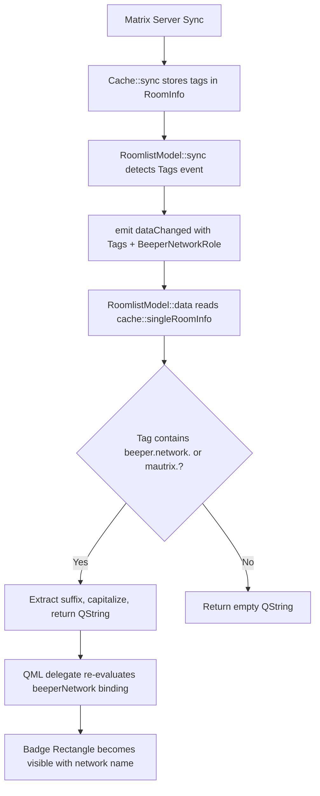

# Beeper Network Badge Plan

## Overview

Display Beeper bridge network names (WhatsApp, Telegram, Signal, etc.) as visual filter badges in the Nheko room list, extracted from custom `m.tag` account data events injected by Beeper bridges.

## Architecture Diagram



## Files to Create

Two new patch files plus edits to `patch-manager.sh`:

1. `patches/0005-beeper-network-badge-model.patch` — C++ model changes
2. `patches/0006-beeper-network-badge-qml.patch` — QML UI changes
3. Edit `patches/patch-manager.sh` — register new patches

---

## Patch 1: `patches/0005-beeper-network-badge-model.patch`

Modifies [`src/timeline/RoomlistModel.h`](nheko/src/timeline/RoomlistModel.h) and [`src/timeline/RoomlistModel.cpp`](nheko/src/timeline/RoomlistModel.cpp).

### A) `RoomlistModel.h` — Add `BeeperNetworkRole` to enum

After `DirectChatOtherUserId,` (line 83), add `BeeperNetworkRole,`:

```diff
         IsDirect,
         DirectChatOtherUserId,
+        BeeperNetworkRole,
     };
```

### B) `RoomlistModel.cpp` — Add role name mapping

In `roleNames()` after the `DirectChatOtherUserId` entry (line 89), add:

```diff
       {DirectChatOtherUserId, "directChatOtherUserId"},
+      {BeeperNetworkRole, "beeperNetwork"},
     };
```

### C) `RoomlistModel.cpp` — Implement `data()` for the new role

Three branches need handling. In the `models.contains(roomid)` block, after the `Tags` case (before `default`):

```diff
             case Roles::Tags: {
                 auto info = cache::singleRoomInfo(roomid.toStdString());
                 QStringList list;
                 list.reserve(static_cast<int>(info.tags.size()));
                 for (const auto &t : info.tags)
                     list.push_back(QString::fromStdString(t));
                 return list;
             }
+            case Roles::BeeperNetworkRole: {
+                auto info = cache::singleRoomInfo(roomid.toStdString());
+                for (const auto &tag : info.tags) {
+                    // Beeper bridge tag: e.g. com.beeper.network.whatsapp
+                    auto beeperPos = tag.find("beeper.network.");
+                    if (beeperPos != std::string::npos) {
+                        auto suffix = tag.substr(beeperPos + 16);
+                        if (!suffix.empty()) {
+                            auto network = QString::fromStdString(suffix);
+                            network[0] = network[0].toUpper();
+                            return network;
+                        }
+                    }
+                    // mautrix bridge tag: e.g. net.mautrix.telegram
+                    auto mautrixPos = tag.find("mautrix.");
+                    if (mautrixPos != std::string::npos) {
+                        auto suffix = tag.substr(mautrixPos + 8);
+                        if (!suffix.empty()) {
+                            auto network = QString::fromStdString(suffix);
+                            network[0] = network[0].toUpper();
+                            return network;
+                        }
+                    }
+                }
+                return QString();
+            }
             default:
                 return {};
```

In the invites branch, after `Tags` case:

```diff
             case Roles::Tags:
                 return QStringList();
+            case Roles::BeeperNetworkRole:
+                return QString();
             default:
```

In the previews branch, after `Tags` case:

```diff
             case Roles::Tags:
                 return QStringList();
+            case Roles::BeeperNetworkRole:
+                return QString();
             default:
```

### D) `RoomlistModel.cpp` — Signal update in `sync()`

Change line 563 to include `BeeperNetworkRole` in the `dataChanged` emission:

```diff
                 if (auto idx = roomidToIndex(qroomid); idx != -1)
-                    emit dataChanged(index(idx), index(idx), {Tags});
+                    emit dataChanged(index(idx), index(idx), {Tags, BeeperNetworkRole});
```

---

## Patch 2: `patches/0006-beeper-network-badge-qml.patch`

Modifies [`resources/qml/RoomList.qml`](nheko/resources/qml/RoomList.qml).

### A) Add `required property string beeperNetwork`

After line 469 (`required property var tags`), add:

```diff
     required property var tags
+    required property string beeperNetwork
     required property string time
```

### B) Add badge widget in `titleRow`

Inside `titleRow` Item (between `titleText` and `timestamp`), add the badge:

```diff
                 ElidedLabel {
                     id: titleText

                     anchors.left: parent.left
                     color: roomItem.importantText
-                    elideWidth: parent.width - (timestamp.visible ? timestamp.implicitWidth : 0) - (spaceNotificationBubble.visible ? spaceNotificationBubble.implicitWidth : 0)
+                    elideWidth: parent.width - (timestamp.visible ? timestamp.implicitWidth : 0) - (beeperBadge.visible ? beeperBadge.width + Nheko.paddingSmall : 0) - (spaceNotificationBubble.visible ? spaceNotificationBubble.implicitWidth : 0)
                     fullText: TimelineManager.htmlEscape(roomName)
                     textFormat: Text.RichText
                 }
+                // Beeper bridge network badge
+                Rectangle {
+                    id: beeperBadge
+
+                    anchors.left: titleText.right
+                    anchors.leftMargin: Nheko.paddingSmall
+                    anchors.verticalCenter: titleText.verticalCenter
+                    color: Qt.alpha(palette.highlight, 0.15)
+                    border.color: Qt.alpha(palette.highlight, 0.4)
+                    border.width: 1
+                    height: beeperLabel.implicitHeight + 4
+                    radius: 3
+                    visible: beeperNetwork !== ""
+                    width: beeperLabel.implicitWidth + 8
+
+                    Text {
+                        id: beeperLabel
+
+                        anchors.centerIn: parent
+                        color: palette.highlight
+                        font.bold: true
+                        font.pixelSize: fontMetrics.font.pixelSize * 0.65
+                        text: beeperNetwork
+                    }
+                }
                 Label {
                     id: timestamp
```

---

## Patch Manager Update

In [`patches/patch-manager.sh`](patches/patch-manager.sh), add the new patches to the `PATCH_FILES` array:

```diff
 PATCH_FILES=(
     "0001-beeper-bridge-fake-dm-cleanup.patch"
     "0002-cache-refresh-accessors.patch"
     "0003-cache-refresh-cmakelists.patch"
+    "0005-beeper-network-badge-model.patch"
+    "0006-beeper-network-badge-qml.patch"
 )
```

---

## Tag Format Reference

| Bridge Tag Pattern | Extracted Suffix | Display |
|---|---|---|
| `com.beeper.network.whatsapp` | `whatsapp` | `Whatsapp` |
| `net.mautrix.telegram` | `telegram` | `Telegram` |
| `net.mautrix.signal` | `signal` | `Signal` |
| `net.mautrix.imessage` | `imessage` | `Imessage` |
| `net.mautrix.discord` | `discord` | `Discord` |
| `m.favourite` (standard) | — | *(no badge)* |
| `u.my-custom-tag` (user) | — | *(no badge)* |

---

## Dynamic Updates

- When the homeserver pushes a sync with updated `m.tag` events for a room, [`RoomlistModel::sync()`](nheko/src/timeline/RoomlistModel.cpp:559) detects the `AccountDataEvent<Tags>` and fires `dataChanged` with both `Tags` **and** `BeeperNetworkRole`
- The QML binding re-evaluates and the badge appears/disappears/updates automatically
- On initial load, `initializeRooms()` triggers a full model reset, so all rooms get their badge state
- The [`FilteredRoomlistModel`](nheko/src/timeline/RoomlistModel.h:166) proxy model transparently passes through all roles, so filtered views also show badges

## Memory / Performance Notes

- `cache::singleRoomInfo()` reads from LMDB via the cache singleton — this is an in-process memory-mapped lookup, not a network call
- The `data()` function is called per-role, per-row during QML binding evaluation. The tag iteration is O(n) where n is the number of tags (typically 0-5), so it's negligible
- No additional caching is needed since `RoomInfo::tags` is already persisted in LMDB

## Edge Cases

- **Room has both beeper and mautrix tags**: Returns first match (beeper checked first)
- **Tag has empty suffix** (e.g., `com.beeper.network.`): Skip, continue to next tag
- **No matching tags**: Returns `QString()` → badge hidden (`visible: beeperNetwork !== ""`)
- **Invite rooms**: Returns `QString()` (no tags available for invites)
- **Preview rooms**: Returns `QString()` (previews don't have tags)
- **Collapsed sidebar**: Badge still visible (it's in `titleRow` which is inside the `visible: !collapsed` ColumnLayout)
