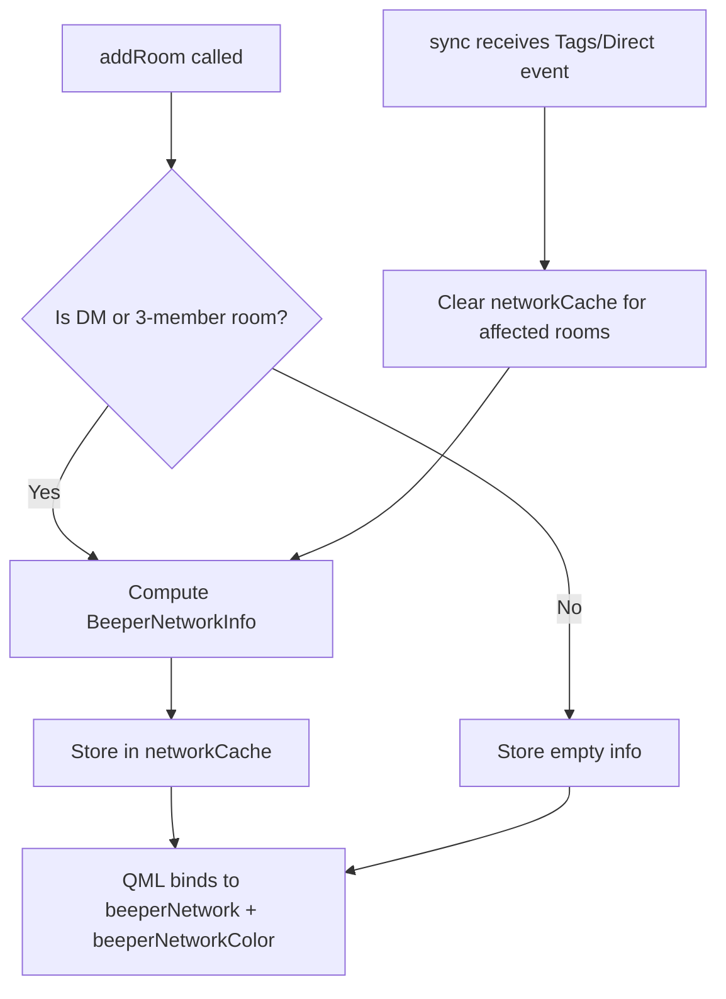

# Beeper Unified Patch Plan — MXID-Based Badges + Custom Labels Manager

## Overview

Two major epics replacing and extending the current Beeper integration in Nheko:

1. **Epic 1 (REPLACES patches 0005/0006):** MXID-based network badges replacing tag-based detection — parse the counterpart user's localpart for known bridge prefixes (`@whatsapp_`, `@instagramgo_`, `@telegram_` etc.) and expose both network name and official brand hex color. **Uses cached `QHash<QString, BeeperNetworkInfo>`** for O(1) `data()` access — populated during room add/sync, invalidated when tags/members change.

2. **Epic 2 (NEW):** Custom Labels / Tags Manager for Beeper-style `m.tag` usage (e.g., `u.pibardos`, `u.work`) with settings UI, context-menu assignment, and sidebar rendering override.

---

## Architecture Diagram

```mermaid
flowchart TD
    subgraph Epic1[MXID-Based Network Badges]
        A[RoomlistModel::data] --> B{Is 1:1 DM or Beeper fake DM?}
        B -->|Yes| C[Get counterpart MXID]
        C --> D[Parse localpart prefix]
        D --> E[Lookup in static prefix→{name, color} map]
        E --> F[Return BeeperNetworkRole + BeeperNetworkColorRole]
        B -->|No| G[Return empty strings]
    end

    subgraph Epic2[Custom Labels Manager]
        H[UserSettings] --> I[CustomLabelsListModel]
        I --> J[UserSettingsPage.qml UI]
        K[RoomList.qml context menu] --> L[Labels sub-menu]
        L --> M[FilteredRoomlistModel::toggleTag]
        N[CommunitiesModel::data] --> O{Tag matches custom label?}
        O -->|Yes| P[Return custom DisplayName + Icon]
        O -->|No| Q[Return raw tag.mid:2]
    end
```

---

---

## Caching Strategy for Network Detection

To avoid LMDB transaction overhead in the hot `data()` path:

1. **`QHash<QString, BeeperNetworkInfo> networkCache`** member on `RoomlistModel`
2. **Population:** On `addRoom()`, compute network info from `directChatToUser` for DMs or via `cache::client()->getMembers()` for potential Beeper fake DMs. Cache the result.
3. **Invalidation:** On `sync()` when `AccountDataEvent<Tags>` or `AccountDataEvent<Direct>` is detected, clear and recompute the cache entry for affected rooms. Emit `dataChanged` with `{BeeperNetworkRole, BeeperNetworkColorRole}`.
4. **`data()` access:** Simply `return networkCache.value(roomid).name` — O(1) average, no LMDB traversal.



---

## Key Design Decisions

### Why MXID-based instead of tag-based for badges?

The user explicitly requested MXID-based detection using the localpart of the counterpart's MXID. The tag-based approach (already in patches 0005/0006) has limitations:

- Tags may not be present on all rooms or may be stale
- Tags don't provide official brand colors
- Multiple bridge formats exist (`com.beeper.network.*`, `net.mautrix.*`)
- MXID localparts are more reliable and consistent: bridges always use predictable prefixes

**Decision:** Replace the tag-based `BeeperNetworkRole` implementation with MXID-based detection. The tag-based code in `data()` (lines 150-175) will be replaced.

### How to get the counterpart MXID

1. **Standard DMs:** Use `directChatToUser` map (already populated from `m.direct` account data). For a DM room, `directChatToUser[roomid].front()` returns the counterpart MXID.

2. **Beeper fake DMs** (3-member rooms with `@*bot:beeper.*` bot): Use the `beeperFakeDmCounterpart` helper already in `Cache.cpp` (from patch 0001). This returns the real contact's `MemberInfo*`. The `RoomlistModel` can access the `Cache::localUserId()` accessor (added in patch 0002).

3. **Group rooms / non-bridged:** Return empty strings for both roles.

### Brand Color Map

Static `QHash<QString, QPair<QString, QString>>` mapping prefix → {DisplayName, HexColor}:

| Localpart Prefix | Network Name | Brand Hex |
|---|---|---|
| `whatsapp_` | WhatsApp | `#25D366` |
| `instagramgo_` | Instagram | `#E1306C` |
| `telegram_` | Telegram | `#2AABEE` |
| `signal_` | Signal | `#3A76F0` |
| `discord_` | Discord | `#5865F2` |
| `facebook_` | Messenger | `#00B2FF` |
| `slack_` | Slack | `#4A154B` |
| `googlechat_` | Google Chat | `#34A853` |
| `linkedin_` | LinkedIn | `#0A66C2` |
| `twitter_` | Twitter/X | `#000000` |
| `sms_` / `smsgo_` | SMS | `#34B7F1` |
| `imessage_` / `imessagego_` | iMessage | `#34C759` |

> **Fallback:** If prefix not in map, return capitalized prefix as name and empty color → QML can use a default palette color.

### Custom Labels Data Structure

```cpp
struct CustomLabel {
    QString tag;        // raw tag e.g. "u.pibardos"
    QString displayName; // user-friendly name e.g. "Pibardos"
    QString iconKey;     // icon identifier from preset list
};
```

Stored in `QSettings` as a JSON array under `user/beeper_custom_labels`.

---

## Patch Breakdown

### Patch 0007: `0007-beeper-mxid-network-badge.patch`

**Replaces patches 0005 and 0006.** Modifies:

#### A) `src/timeline/RoomlistModel.h`

1. Keep `BeeperNetworkRole` enum entry (already there from 0005)
2. Add `BeeperNetworkColorRole` after `BeeperNetworkRole`:

```cpp
        BeeperNetworkRole,
        BeeperNetworkColorRole,
```

3. No changes to the enum entries for invites/previews (0005 already added `BeeperNetworkRole` there, we extend to include color)

#### B) `src/timeline/RoomlistModel.cpp`

**In `roleNames()`**, add color role mapping:

```cpp
      {BeeperNetworkRole, "beeperNetwork"},
      {BeeperNetworkColorRole, "beeperNetworkColor"},
```

**In `data()`**, **REPLACE** the tag-based `BeeperNetworkRole` case (lines 150-175) with a new implementation:

```cpp
case Roles::BeeperNetworkRole: {
    auto [network, color] = beeperNetworkForRoom(roomid);
    return network;
}
case Roles::BeeperNetworkColorRole: {
    auto [network, color] = beeperNetworkForRoom(roomid);
    return color;
}
```

**New static helper function** `beeperNetworkForRoom(const QString &roomid)`:

```cpp
namespace {

struct BeeperNetworkInfo {
    QString name;
    QString color;
};

// Static lookup table for known bridge MXID prefixes
static const QHash<QString, QPair<QString, QString>> beeperPrefixMap = {
    {"whatsapp_",     {"WhatsApp",     "#25D366"}},
    {"whatsappgo_",   {"WhatsApp",     "#25D366"}},
    {"instagramgo_",  {"Instagram",    "#E1306C"}},
    {"telegram_",     {"Telegram",     "#2AABEE"}},
    {"telegramgo_",   {"Telegram",     "#2AABEE"}},
    {"signal_",       {"Signal",       "#3A76F0"}},
    {"signalgo_",     {"Signal",       "#3A76F0"}},
    {"discord_",      {"Discord",      "#5865F2"}},
    {"discordgo_",    {"Discord",      "#5865F2"}},
    {"facebook_",     {"Messenger",    "#00B2FF"}},
    {"facebookgo_",   {"Messenger",    "#00B2FF"}},
    {"slack_",        {"Slack",        "#4A154B"}},
    {"slackgo_",      {"Slack",        "#4A154B"}},
    {"googlechat_",   {"Google Chat",  "#34A853"}},
    {"googlechatgo_", {"Google Chat",  "#34A853"}},
    {"linkedin_",     {"LinkedIn",     "#0A66C2"}},
    {"linkedingo_",   {"LinkedIn",     "#0A66C2"}},
    {"twitter_",      {"Twitter/X",    "#000000"}},
    {"twittergo_",    {"Twitter/X",    "#000000"}},
    {"sms_",          {"SMS",          "#34B7F1"}},
    {"smsgo_",        {"SMS",          "#34B7F1"}},
    {"imessage_",     {"iMessage",     "#34C759"}},
    {"imessagego_",   {"iMessage",     "#34C759"}},
    {"groupme_",      {"GroupMe",      "#00AFF0"}},
    {"groupmego_",    {"GroupMe",      "#00AFF0"}},
    {"skype_",        {"Skype",        "#00AFF0"}},
    {"skypego_",      {"Skype",        "#00AFF0"}},
    {"wechat_",       {"WeChat",       "#07C160"}},
    {"wechatgo_",     {"WeChat",       "#07C160"}},
    {"line_",         {"LINE",         "#00C300"}},
    {"linego_",       {"LINE",         "#00C300"}},
    {"kakaotalk_",    {"KakaoTalk",    "#FEE500"}},
    {"kakaotalkgo_",  {"KakaoTalk",    "#FEE500"}},
};

BeeperNetworkInfo beeperNetworkForRoom(const RoomlistModel *model, const QString &roomid)
{
    // 1. Check standard DMs
    if (model->directChatToUser.count(roomid)) {
        const auto &userId = model->directChatToUser.at(roomid).front();
        return beeperNetworkFromMxid(userId);
    }

    // 2. Check Beeper fake DMs (3-member rooms with bridge bot)
    // Access members via timeline model
    if (model->models.contains(roomid)) {
        auto room = model->models.value(roomid);
        // Check member count via cache
        auto members = cache::client()->getMembers(roomid.toStdString(), 0, 4);
        if (members.size() == 3) {
            // Find the non-local, non-bot member
            QString localUser = cache::client()->localUserId();
            for (const auto &m : members) {
                if (m.user_id == localUser)
                    continue;
                if (m.user_id.contains(QStringLiteral("bot"), Qt::CaseInsensitive) &&
                    m.user_id.contains(QStringLiteral(":beeper.")))
                    continue;
                // This is the real contact
                return beeperNetworkFromMxid(m.user_id);
            }
        }
    }

    return {};
}

BeeperNetworkInfo beeperNetworkFromMxid(const QString &mxid)
{
    // Parse localpart: @prefix_rest:server → extract prefix_
    auto atPos = mxid.indexOf(QLatin1Char('@'));
    if (atPos < 0)
        return {};
    auto colonPos = mxid.indexOf(QLatin1Char(':'), atPos + 1);
    if (colonPos < 0)
        return {};

    auto localpart = mxid.mid(atPos + 1, colonPos - atPos - 1);

    // Try to match known prefixes (longest match first to handle
    // e.g. "instagramgo_" vs "instagram_")
    // Walk through the map and find the best matching prefix
    for (auto it = beeperPrefixMap.begin(); it != beeperPrefixMap.end(); ++it) {
        if (localpart.startsWith(it.key(), Qt::CaseInsensitive)) {
            return {it.value().first, it.value().second};
        }
    }

    // Fallback: try to extract a reasonable network name from the prefix
    // e.g. "@somebridge_12345:server" → "Somebridge"
    auto underscorePos = localpart.indexOf(QLatin1Char('_'));
    if (underscorePos > 0) {
        auto prefix = localpart.left(underscorePos);
        // Remove trailing "go" suffix common in Beeper bridges
        if (prefix.endsWith(QStringLiteral("go"), Qt::CaseInsensitive))
            prefix.chop(2);
        if (!prefix.isEmpty()) {
            prefix[0] = prefix[0].toUpper();
            return {prefix, QString()};
        }
    }

    return {};
}

} // namespace
```

**Note:** The `directChatToUser` member is private. We need to either make `beeperNetworkForRoom` a friend function or add a public accessor method. Since the function is file-local, we can declare it as a friend in `RoomlistModel.h`:

```cpp
// In RoomlistModel.h, add before the class closing brace:
friend BeeperNetworkInfo beeperNetworkForRoom(const RoomlistModel *, const QString &);
```

**In `sync()`** (around line 595), add `BeeperNetworkColorRole` to the dataChanged emission:

```cpp
emit dataChanged(index(idx), index(idx), {Tags, BeeperNetworkRole, BeeperNetworkColorRole});
```

**In all data() branches where `BeeperNetworkRole` returns `QString()`**, add matching:

```cpp
case Roles::BeeperNetworkColorRole:
    return QString();
```

#### C) `resources/qml/RoomList.qml`

Add `required property string beeperNetworkColor` and update the badge:

```qml
required property string beeperNetworkColor

// ... inside beeperBadge Rectangle:
color: beeperNetworkColor !== "" ? beeperNetworkColor : Qt.alpha(palette.highlight, 0.15)
border.color: beeperNetworkColor !== "" ? Qt.darker(beeperNetworkColor, 1.3) : Qt.alpha(palette.highlight, 0.4)
```

For text color inside the badge, use a contrast helper:

```qml
property bool isLightColor: {
    if (beeperNetworkColor === "") return false;
    var c = beeperNetworkColor;
    var r = parseInt(c.substr(1,2), 16) / 255;
    var g = parseInt(c.substr(3,2), 16) / 255;
    var b = parseInt(c.substr(5,2), 16) / 255;
    var luminance = 0.2126 * r + 0.7152 * g + 0.0722 * b;
    return luminance > 0.6;
}
// Text color:
color: isLightColor ? "#000000" : "#ffffff"
```

---

### Patch 0008: `0008-custom-labels-cpp.patch`

#### A) `src/UserSettingsPage.h`

Add to `UserSettings` class:

**New struct (before class):**
```cpp
struct CustomLabel {
    Q_GADGET
    Q_PROPERTY(QString tag MEMBER tag CONSTANT)
    Q_PROPERTY(QString displayName MEMBER displayName CONSTANT)
    Q_PROPERTY(QString iconKey MEMBER iconKey CONSTANT)
public:
    QString tag, displayName, iconKey;
};
```

**New methods in `UserSettings`:**
```cpp
Q_PROPERTY(QVariantList customLabels READ customLabels NOTIFY customLabelsChanged)

public:
    QVariantList customLabels() const;
    void addCustomLabel(const QString &tag, const QString &displayName, const QString &iconKey);
    void removeCustomLabel(const QString &tag);
    void updateCustomLabel(const QString &tag, const QString &displayName, const QString &iconKey);
    QString customLabelDisplayName(const QString &rawTag) const;
    QString customLabelIconKey(const QString &rawTag) const;

signals:
    void customLabelsChanged();

private:
    QVariantList customLabels_;
    void loadCustomLabels();
    void saveCustomLabels();
```

**New class for QML display:**
```cpp
class CustomLabelListModel : public QAbstractListModel
{
    Q_OBJECT
    QML_ELEMENT
    QML_SINGLETON

public:
    enum Roles {
        Tag = Qt::UserRole,
        DisplayName,
        IconKey,
    };

    CustomLabelListModel(QObject *parent = nullptr);
    QHash<int, QByteArray> roleNames() const override;
    int rowCount(const QModelIndex &parent = QModelIndex()) const override { return labels_.size(); }
    QVariant data(const QModelIndex &index, int role) const override;

    Q_INVOKABLE void addLabel(const QString &tag, const QString &displayName, const QString &iconKey);
    Q_INVOKABLE void removeLabel(int row);
    Q_INVOKABLE void updateLabel(int row, const QString &tag, const QString &displayName, const QString &iconKey);
    Q_INVOKABLE QStringList availableIcons() const;
    Q_INVOKABLE QString displayNameForTag(const QString &tag) const;
    Q_INVOKABLE QString iconKeyForTag(const QString &tag) const;

private slots:
    void refreshFromSettings();

private:
    QList<CustomLabel> labels_;
};
```

#### B) `src/UserSettingsPage.cpp`

Implement `loadCustomLabels()`, `saveCustomLabels()`, and all `CustomLabelListModel` methods:

```cpp
void UserSettings::loadCustomLabels()
{
    customLabels_.clear();
    auto raw = settings.value("user/beeper_custom_labels").toList();
    for (const auto &item : raw) {
        auto map = item.toMap();
        CustomLabel label;
        label.tag         = map.value("tag").toString();
        label.displayName  = map.value("displayName").toString();
        label.iconKey      = map.value("iconKey").toString();
        if (!label.tag.isEmpty() && !label.displayName.isEmpty())
            customLabels_.append(QVariant::fromValue(label));
    }
}

// Call loadCustomLabels() in UserSettings::load()

QString UserSettings::customLabelDisplayName(const QString &rawTag) const
{
    for (const auto &v : customLabels_) {
        auto label = v.value<CustomLabel>();
        if (label.tag == rawTag)
            return label.displayName;
    }
    return {};
}

// Icon key preset list for CustomLabelListModel:
QStringList CustomLabelListModel::availableIcons() const
{
    return {
        ":/icons/icons/ui/tag.svg",         // default tag icon
        ":/icons/icons/ui/star.svg",        // star/favorite
        ":/icons/icons/ui/bookmark.svg",    // bookmark
        ":/icons/icons/ui/chat.svg",        // chat bubble
        ":/icons/icons/ui/clock.svg",       // clock/time
        ":/icons/icons/ui/building-shop.svg", // building/work
        ":/icons/icons/ui/people.svg",      // people/group
        ":/icons/icons/ui/world.svg",       // globe/world
        ":/icons/icons/ui/alert.svg",       // alert/important
        ":/icons/icons/ui/checkmark.svg",   // checkmark/done
    };
}
```

#### C) `src/timeline/CommunitiesModel.cpp`

**In `data()`**, modify the tag rendering at line 194-199. Replace:

```cpp
} else {
    switch (role) {
    case CommunitiesModel::Roles::AvatarUrl:
        return QStringLiteral(":/icons/icons/ui/tag.svg");
    case CommunitiesModel::Roles::DisplayName:
    case CommunitiesModel::Roles::Tooltip:
        return tag.mid(2);
    }
}
```

With:

```cpp
} else {
    // Check for Beeper custom label override
    auto customName = UserSettings::instance()->customLabelDisplayName(tag);
    auto customIcon = UserSettings::instance()->customLabelIconKey(tag);

    switch (role) {
    case CommunitiesModel::Roles::AvatarUrl:
        if (!customIcon.isEmpty())
            return customIcon;
        return QStringLiteral(":/icons/icons/ui/tag.svg");
    case CommunitiesModel::Roles::DisplayName:
    case CommunitiesModel::Roles::Tooltip:
        if (!customName.isEmpty())
            return customName;
        return tag.mid(2);
    }
}
```

---

### Patch 0009: `0009-custom-labels-qml.patch`

#### A) `resources/qml/pages/UserSettingsPage.qml`

Add at the end of the `ColumnLayout` (before closing):

```qml
// --- Beeper Custom Labels Section ---
Item {
    Layout.fillWidth: true
    Layout.preferredHeight: 1
    Layout.topMargin: Nheko.paddingLarge
    color: palette.buttonText
    opacity: 0.3
}

Label {
    Layout.fillWidth: true
    font.pointSize: fontMetrics.font.pointSize * 1.3
    font.weight: Font.DemiBold
    text: qsTr("Custom Beeper Labels")
    color: palette.text
}

Label {
    Layout.fillWidth: true
    font.pointSize: fontMetrics.font.pointSize * 0.9
    text: qsTr("Define custom names and icons for your Beeper tags. These will appear in the sidebar and room context menus.")
    color: palette.buttonText
    wrapMode: Text.WordWrap
}

ColumnLayout {
    id: customLabelsContainer
    Layout.fillWidth: true
    spacing: Nheko.paddingSmall

    Repeater {
        id: labelsRepeater
        model: CustomLabelListModel

        delegate: RowLayout {
            Layout.fillWidth: true
            spacing: Nheko.paddingSmall

            TextField {
                Layout.fillWidth: true
                Layout.preferredWidth: parent.width * 0.3
                text: model.displayName
                placeholderText: qsTr("Display Name")
                onTextChanged: CustomLabelListModel.updateLabel(index, model.tag, text, model.iconKey)
            }

            ComboBox {
                id: iconCombo
                Layout.preferredWidth: 120
                model: CustomLabelListModel.availableIcons()
                currentIndex: {
                    var icons = CustomLabelListModel.availableIcons();
                    return Math.max(0, icons.indexOf(model.iconKey));
                }
                onCurrentIndexChanged: {
                    if (currentIndex >= 0) {
                        var icons = CustomLabelListModel.availableIcons();
                        CustomLabelListModel.updateLabel(index, model.tag, model.displayName, icons[currentIndex]);
                    }
                }
            }

            Label {
                text: model.tag
                color: palette.buttonText
                font.pixelSize: fontMetrics.font.pixelSize * 0.85
                Layout.preferredWidth: 80
                elide: Text.ElideRight
            }

            ImageButton {
                Layout.preferredWidth: 22
                Layout.preferredHeight: 22
                image: ":/icons/icons/ui/delete.svg"
                ToolTip.text: qsTr("Remove label")
                ToolTip.visible: hovered
                hoverEnabled: true
                onClicked: CustomLabelListModel.removeLabel(index)
            }
        }
    }

    Button {
        text: qsTr("Add Custom Label")
        Layout.alignment: Qt.AlignLeft
        onClicked: addCustomLabelDialog.open()

        Dialog {
            id: addCustomLabelDialog
            title: qsTr("Add Custom Label")
            standardButtons: Dialog.Ok | Dialog.Cancel
            modal: true

            ColumnLayout {
                spacing: Nheko.paddingMedium
                Label {
                    text: qsTr("Tag (e.g., u.pibardos):")
                }
                TextField {
                    id: newTagField
                    placeholderText: "u.mylabel"
                    Layout.fillWidth: true
                }
                Label {
                    text: qsTr("Display Name:")
                }
                TextField {
                    id: newNameField
                    placeholderText: qsTr("My Label")
                    Layout.fillWidth: true
                }
            }

            onAccepted: {
                if (newTagField.text && newNameField.text) {
                    CustomLabelListModel.addLabel(newTagField.text, newNameField.text, ":/icons/icons/ui/tag.svg");
                }
            }
        }
    }
}
```

#### B) `resources/qml/RoomList.qml`

Modify `tagsMenu` (lines 825-862) to include custom labels:

After the standard tags `Instantiator`, add a `MenuSeparator` and another `Instantiator` for custom labels:

```qml
Menu {
    id: tagsMenu

    title: qsTr("Tag room as:")

    // Standard tags (existing)
    Instantiator {
        model: Communities.tagsWithDefault
        // ... existing delegate ...
    }

    MenuSeparator {
        visible: customLabelTags.count > 0
    }

    // Custom Beeper labels
    Instantiator {
        id: customLabelInstantiator
        model: customLabelTags

        delegate: MenuItem {
            property string t: modelData.tag

            checkable: true
            checked: roomContextMenu.tags !== undefined && roomContextMenu.tags.includes(t)
            text: modelData.displayName

            onTriggered: Rooms.toggleTag(roomContextMenu.roomid, t, checked)
        }

        onObjectAdded: (index, object) => tagsMenu.insertItem(index + Communities.tagsWithDefault.length + 1, object)
        onObjectRemoved: (index, object) => tagsMenu.removeItem(object)
    }

    MenuItem {
        text: qsTr("Create new tag...")
        onTriggered: newTag.show()
    }
}
```

The `customLabelTags` list model is populated from `CustomLabelListModel` via a QML binding or a JS array constructed at menu-open time.

**Simpler approach** — replace the model-based approach with a function call:

```qml
Menu {
    id: tagsMenu
    title: qsTr("Tag room as:")

    Instantiator {
        model: Communities.tagsWithDefault
        // ... existing delegate unchanged ...
    }

    // Populate custom labels dynamically from CustomLabelListModel
    Instantiator {
        model: CustomLabelListModel
        delegate: MenuItem {
            checkable: true
            checked: roomContextMenu.tags !== undefined && roomContextMenu.tags.includes(model.tag)
            text: model.displayName
            onTriggered: Rooms.toggleTag(roomContextMenu.roomid, model.tag, checked)
        }
        onObjectAdded: (index, object) => {
            var insertIdx = index + Communities.tagsWithDefault.length;
            if (insertIdx < tagsMenu.count - 1)
                tagsMenu.insertItem(insertIdx, object);
            else
                tagsMenu.addItem(object);
        }
        onObjectRemoved: (index, object) => tagsMenu.removeItem(object)
    }

    MenuItem {
        text: qsTr("Create new tag...")
        onTriggered: newTag.show()
    }
}
```

---

## Files to Create/Modify Summary

### New Patch Files
| Patch | Description | Affected Files |
|---|---|---|
| `patches/0007-beeper-mxid-network-badge.patch` | MXID-based network badge with color | `RoomlistModel.h`, `RoomlistModel.cpp`, `RoomList.qml` |
| `patches/0008-custom-labels-cpp.patch` | Custom Labels C++ model & settings | `UserSettingsPage.h`, `UserSettingsPage.cpp`, `CommunitiesModel.cpp` |
| `patches/0009-custom-labels-qml.patch` | Custom Labels QML UI | `UserSettingsPage.qml`, `RoomList.qml` |

### Removed/Obsoloted Patches
| Patch | Reason |
|---|---|
| `0005-beeper-network-badge-model.patch` | Replaced by 0007 (tag-based → MXID-based) |
| `0006-beeper-network-badge-qml.patch` | Replaced by 0007 (new QML badge with brand colors) |

### patch-manager.sh Changes
- Remove `0005` and `0006` from `PATCH_FILES` array
- Add `0007`, `0008`, `0009`

---

## Dynamic Updates

- **Network badges:** When `sync()` detects `AccountDataEvent<Tags>` changes, it emits `dataChanged` with `{Tags, BeeperNetworkRole, BeeperNetworkColorRole}`. The QML bindings re-evaluate and the badge updates.
- **Custom labels:** `CustomLabelListModel` refreshes from settings on `customLabelsChanged()` signal. The `CommunitiesModel` re-reads custom labels on each `data()` call (O(n) for typically < 20 labels, negligible).
- **Context menu:** The `tagsMenu` `Instantiator` re-populates whenever the menu opens because `CustomLabelListModel` is a singleton that reflects current settings.

---

## Performance Considerations

- `beeperNetworkForRoom()`: O(1) lookup in `directChatToUser` map + O(k) string prefix matching where k ≈ 40 entries. For non-DM rooms, returns immediately.
- `customLabelDisplayName()`: Linear scan of custom labels list (typically < 20 items), called once per tag row in `CommunitiesModel::data()`. Acceptable.
- `cache::client()->getMembers()`: LMDB cursor read returning up to 4 members — very fast.
- The `communitiesList` list view reuses delegates; custom label lookup is per-item, not per-pixel.

---

## Edge Cases

- **Room is a group chat** (not DM, not fake DM): Both roles return empty → badge hidden.
- **MXID has no underscore in localpart**: Fallback returns empty.
- **Unknown bridge prefix** (not in map): Fallback extracts text before underscore as capitalized name, color empty → QML uses default palette.
- **Custom label deleted** while rooms still have that tag: Tag continues to exist as `m.tag`; `CommunitiesModel` falls back to `tag.mid(2)` rendering.
- **Duplicate custom labels for same tag**: Last-one-wins during linear scan (load order from settings).
- **Empty custom label name/icon**: `CommunitiesModel` falls through to default rendering.
