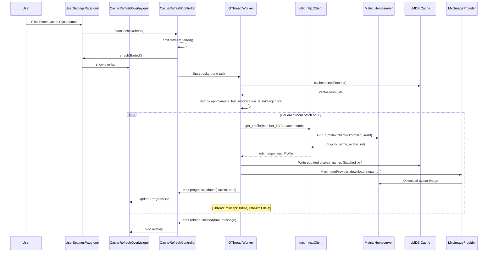
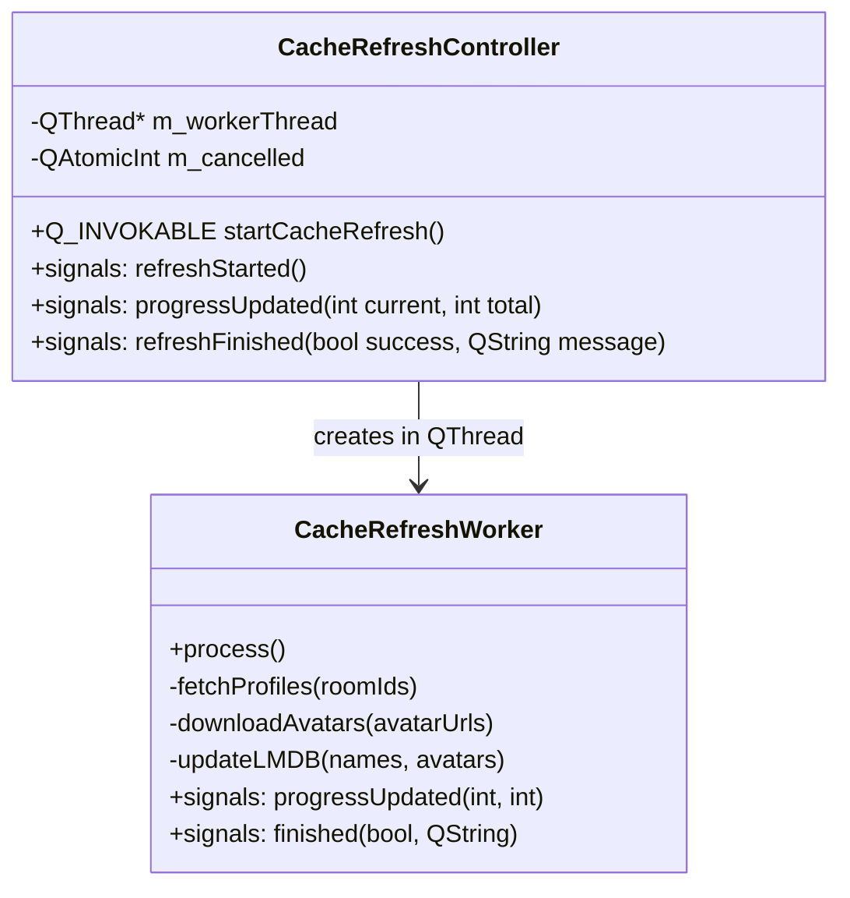
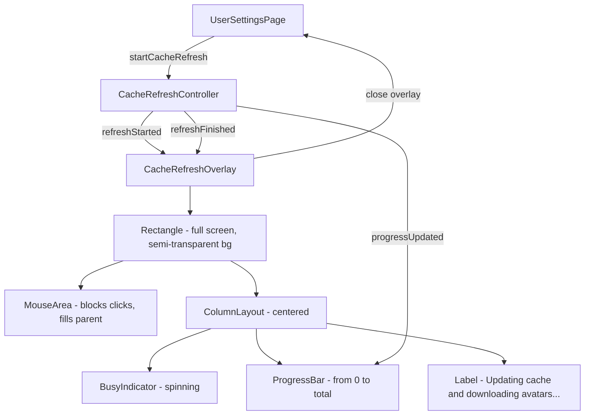

# Cache Refresh Controller - Architectural Plan

## Overview

This feature adds a "Force Cache Sync" mechanism to Nheko that refreshes display names and downloads avatars for the last 1000 active chats. This is needed when a Nheko instance was initialized with an older build and doesn't have up-to-date profile data cached.

## Architecture Diagram



## Component Design

### 1. CacheRefreshController (C++ Backend)



**Key Design Decisions:**

- **QThread + Worker pattern** (NOT QtConcurrent): Better lifecycle control, cancellation support, and signal/slot communication across thread boundaries.
- **Singleton via QML_ELEMENT + QML_SINGLETON**: Matches Nheko's existing pattern (see [`NhekoGlobalObject.h`](nheko/src/ui/NhekoGlobalObject.h:24)).
- **Batching strategy**: Process rooms in groups of 50 with 200ms delay between batches to avoid HTTP 429 rate limiting.
- **LMDB write optimization**: Accumulate updates in-memory, then apply in a single LMDB write transaction per batch to minimize I/O overhead.

### 2. HTTP API Usage (mtxclient)

The existing `mtx::http::Client` API provides:
```cpp
http::client()->get_profile(userId,
    [](const mtx::responses::Profile &res, mtx::http::RequestErr err) {
        // res.display_name -> std::string
        // res.avatar_url  -> std::string (mxc://...)
    });
```

Avatar downloading uses the existing [`MxcImageProvider::download()`](nheko/src/MxcImageProvider.h:87):
```cpp
MxcImageProvider::download(mxcId, QSize(128, 128),
    [](QString id, QSize, QImage img, QString) {
        // img contains the downloaded avatar
    });
```

### 3. Room Sorting Strategy

Retrieve joined rooms via [`cache::joinedRooms()`](nheko/src/Cache.h:60), get [`RoomInfo`](nheko/src/CacheStructs.h:70) for each (which includes `approximate_last_modification_ts`), sort descending by timestamp, and take the top 1000.

### 4. QML Overlay Design



### 5. CMakeLists Integration

Since Nheko uses `qt_add_qml_module` or similar Qt6 CMake macros, the new files need to be added to the source list. The exact approach depends on whether the project uses `qt_standard_project_setup()` with automatic source scanning or explicit source file lists. Investigation of the CMakeLists.txt beyond line 100 is needed.

## File Manifest

| File | Purpose |
|------|---------|
| `src/CacheRefreshController.h` | Header with `QML_ELEMENT`, `QML_SINGLETON`, Q_INVOKABLE, signals |
| `src/CacheRefreshController.cpp` | Worker thread, batching logic, LMDB writes, HTTP calls |
| `resources/qml/ui/CacheRefreshOverlay.qml` | Modal overlay with BusyIndicator, ProgressBar, blocking MouseArea |
| `resources/qml/pages/UserSettingsPage.qml` | Modified: add button + overlay integration |
| `CMakeLists.txt` | Add new `.cpp` and `.h` files to build |

## LMDB Write Optimization Strategy

Rather than writing individual display_name updates per profile fetch (which causes excessive disk I/O), the worker:

1. Accumulates all profile results in a `std::map<std::string, std::pair<std::string, std::string>>` (room_id -> {display_name, avatar_url})
2. Every 50 profiles (one batch), opens a single LMDB write transaction
3. Writes all accumulated updates in that single transaction
4. This batches disk writes and leverages LMDB's MVCC for consistency

For member name updates specifically, the worker interacts with the room's member state in LMDB by updating the `MemberInfo` structs stored in each room's member database.

## Registration Instructions

No explicit `qmlRegisterSingletonType` call is needed. With Qt6's declarative registration, adding these macros to the header is sufficient:

```cpp
class CacheRefreshController : public QObject
{
    Q_OBJECT
    QML_ELEMENT
    QML_SINGLETON
    // ...
};
```

Qt6's `qt_add_qml_module` in CMakeLists.txt automatically discovers types with these macros and registers them. The QML import `im.nheko` (already imported in [`UserSettingsPage.qml`](nheko/resources/qml/pages/UserSettingsPage.qml:12)) will expose `CacheRefreshController` globally.

## Error Handling

- **Network errors**: Individual profile fetch failures are logged and skipped; the overall refresh continues
- **Rate limiting (HTTP 429)**: The worker checks for retry-after headers and adds exponential backoff
- **LMDB errors**: Caught via try/catch around transaction commits; reported via `refreshFinished(false, errorMsg)`
- **Cancellation**: The `m_cancelled` atomic flag is checked between batches; setting it gracefully stops the worker
- **Empty cache**: If `joinedRooms()` returns empty, the refresh completes immediately with a success message
