# Corrections Roadmap — Avatar Outlines, Room Ordering & Performance

> **STATUS: 🔵 PLANNING — Awaiting user review and approval**

---

## Overview

This roadmap addresses three categories of issues found in the Nheko+Beeper patch set:

1. **Avatar network outlines not rendering** — The `networkOutlineColor` border on avatars never appears, even when the feature is enabled and the user is on a Beeper-bridged network.
2. **Room list ordering breaks after reinit** — After a full Beeper reinit (or for accounts with many rooms), the room list jumps to old/unordered chats. Not all rooms appear to be loaded correctly.
3. **Performance & rendering optimizations** — Builds on the existing [`plans/scroll-performance-optimization.md`](plans/scroll-performance-optimization.md) with additional findings.

---

## Issue #1: Avatar Network Outlines Not Working

### Root Cause Analysis

The outline feature is implemented in the unified patch [`patches/0000-unified-nhekobeep.patch`](patches/0000-unified-nhekobeep.patch) (lines 29-50):

```qml
// Avatar.qml — unified patch additions
readonly property color networkOutlineColor:
    (Settings.networkOutline && avatar.userid !== "")
        ? Rooms.networkColorForMxid(avatar.userid)
        : "transparent"

// background Rectangle
border.color: avatar.networkOutlineColor
border.width: avatar.networkOutlineColor.a > 0 ? 3 : 0
```

The implementation depends on three things all working correctly:

1. **`Settings.networkOutline`** — User setting, defaults to `true`.
2. **`avatar.userid`** — Must be non-empty for the outline to activate. This is set in [`RoomList.qml`](nheko/resources/qml/RoomList.qml:566) as `userid: isDirect ? directChatOtherUserId : ""`.
3. **`Rooms.networkColorForMxid(mxid)`** — `Q_INVOKABLE` on `FilteredRoomlistModel` that parses the MXID localpart against a static prefix map (`whatsapp_`, `telegram_`, etc.) and returns the brand color.

#### Identified Failure Points

| # | Failure | Impact |
|---|---------|--------|
| **A** | `Rooms.networkColorForMxid()` is defined on `FilteredRoomlistModel` but the binding in `Avatar.qml` uses `Rooms.` which references the QML singleton. The method returns a **default-constructed `QColor{}`** (invalid, alpha=0) when no prefix matches. For non-bridged users this is correct — but the function also returns `QColor{}` when the MXID format doesn't match expectations. | Border never shown |
| **B** | The `networkColorForMxid` function searches for `@` via `mxid.indexOf(QLatin1Char('@'))` starting from position `atPos + 1`. For a valid MXID like `@whatsapp_12345:beeper.com`, `atPos` would be `0`. But if the MXID string is malformed or missing the `@`, the function silently returns `QColor{}`. | Border never shown |
| **C** | The `avatar.userid` in `RoomList.qml` is only set for DMs (`isDirect ? directChatOtherUserId : ""`). For non-DM rooms that are actually Beeper fake DMs (3-member rooms), **the userid is empty**, so no outline is ever shown. Even though `updateNetworkCache` correctly identifies the counterpart MXID for Beeper fake DMs and stores it in `BeeperNetworkInfo.counterpartMxid`, this mxid is never exposed to the QML `Avatar` component. | No outline on room list avatars for Beeper bridge rooms |
| **D** | The `Avatar.qml` uses `Rooms.networkColorForMxid(avatar.userid)` but never uses the cached `BeeperNetworkColorRole` or `BeeperNetworkOtherUserId` roles from the `RoomlistModel`. This means every avatar binding independently calls the slow MXID parsing function, and **the cached counterpart MXID from `networkCache` is never used**. | Performance waste + functional gap |

#### Proposed Fixes

**Fix 1A: Add counterpart MXID role to RoomlistModel and expose to QML**

Currently the room list delegate in `RoomList.qml` has:
```qml
userid: isDirect ? directChatOtherUserId : ""
```

This should also use the cached `BeeperNetworkOtherUserId` for Beeper fake DMs:
```qml
userid: isDirect ? directChatOtherUserId : (beeperNetworkOtherUserId || "")
```

This requires:
- Adding a new role `BeeperNetworkOtherUserId` to `RoomlistModel::roleNames()` and `data()`
- The `data()` function returns `networkCache.value(roomid).counterpartMxid`

**Fix 1B: Ensure `networkColorForMxid` returns a valid color for all bridge prefixes**

The static prefix map is comprehensive but the MXID parsing should be robust:
- Accept MXIDs with or without leading `@`
- Log a debug warning when an MXID is passed but no prefix matches (helps diagnose bridge detection issues)
- Consider also checking the `BeeperNetworkColorRole` cached value as a fallback

**Fix 1C: Use cached network color from RoomlistModel instead of calling `networkColorForMxid` repeatedly**

Instead of `Rooms.networkColorForMxid(avatar.userid)` in `Avatar.qml`, use the cached role from the model. But since `Avatar.qml` is used in many contexts (not just RoomList), we need a hybrid approach:
- For `RoomList.qml` delegates: pass `beeperNetworkColor` from the model directly
- For standalone `Avatar` instances: keep the `networkColorForMxid` fallback

**Fix 1D: Verify `Settings.networkOutline` default and persistence**

The setting defaults to `true` in the unified patch. Verify it's properly persisted in QSettings and that the `UserSettingsPage.qml` toggle is correctly connected.

### Implementation Plan — Issue #1

**Patch: `00XX-avatar-outline-fix.patch`**

Files to modify:
- [`nheko/resources/qml/Avatar.qml`](nheko/resources/qml/Avatar.qml) — Add `beeperNetworkColor` property, use cached color when available
- [`nheko/resources/qml/RoomList.qml`](nheko/resources/qml/RoomList.qml) — Pass `beeperNetworkOtherUserId` as `userid` for Beeper fake DMs, pass `beeperNetworkColor` to Avatar
- [`nheko/src/timeline/RoomlistModel.cpp`](nheko/src/timeline/RoomlistModel.cpp) — Add `BeeperNetworkOtherUserId` to roleNames() and data()
- [`nheko/src/timeline/RoomlistModel.h`](nheko/src/timeline/RoomlistModel.h) — Declare new role

---

## Issue #2: Room List Ordering Breaks After Reinit / Large Accounts

### Root Cause Analysis

The room list ordering has **three compounding problems**:

#### Problem 2A: Initial room loading is alphabetical, not temporal

[`RoomlistModel::initializeRooms()`](nheko/src/timeline/RoomlistModel.cpp:610) loads rooms from LMDB via `cache::client()->roomIds()`. The LMDB rooms database is keyed by `room_id`, and cursor iteration returns rooms in **lexicographic order by room_id**. 

Rooms are appended to `roomids` vector in this order. The `FilteredRoomlistModel` proxy then sorts by `Timestamp` role. If timestamps are all zero (not yet populated), the fallback comparison is `return left.row() < right.row()` — which preserves the alphabetical insertion order.

This means on cold start:
1. Rooms appear alphabetically
2. As incremental sync responses arrive and update timestamps, rooms jump to their correct temporal position
3. This causes visible "jumping" in the room list

#### Problem 2B: Phase 3b of BeeperReinitController discards /messages responses

In [`BeeperReinitController.cpp`](nheko/src/BeeperReinitController.cpp:349-364), Phase 3b fetches `/messages` for each room but the callback only **logs** the result:

```cpp
http::client()->messages(
    opts,
    [&msgDone, &msgOk, &roomId](const mtx::responses::Messages &msgs,
                                mtx::http::RequestErr err) {
        if (!err) {
            nhlog::net()->debug("BeeperReinit: fetched {} messages for {}",
                                msgs.chunk.size(), roomId);
            msgOk.store(true);  // ← Marks success but DOES NOT save!
        }
        ...
    });
```

The fetched messages are **never written to LMDB**. The initial sync only provides ~10-20 timeline events per room. For rooms where the most recent message was not in those 10-20 events, the `lastMessageTimestamp()` will be stale or zero.

#### Problem 2C: `approximate_last_modification_ts` may not be populated from initial sync

The [`CacheStructs.h`](nheko/src/CacheStructs.h:96) `RoomInfo` struct has:
```cpp
uint64_t approximate_last_modification_ts = 0;
```

This is populated from the sync response's room summary. If the server doesn't provide it or the sync response parsing doesn't extract it, it remains `0`. Looking at the `saveState` implementation, the room info is serialized/deserialized from JSON. The field `app_l_ts` is read in [`Cache.cpp`](nheko/src/Cache.cpp:5767):
```cpp
info.approximate_last_modification_ts = j.value<uint64_t>("app_l_ts", 0);
```

If the server's initial sync doesn't include this in the room summary, all rooms will have timestamp `0`.

### Proposed Fixes

**Fix 2A: Save /messages response to LMDB during reinit Phase 3b**

In [`BeeperReinitController.cpp`](nheko/src/BeeperReinitController.cpp:349), modify the `/messages` callback to actually persist the fetched events to LMDB:

```cpp
http::client()->messages(opts,
    [&msgDone, &msgOk, &roomId](const mtx::responses::Messages &msgs,
                                mtx::http::RequestErr err) {
        if (!err && !msgs.chunk.empty()) {
            // Save fetched messages to LMDB
            auto txn = lmdb::txn::begin(cache::client()->env());
            auto eventsDb = cache::client()->openEventsDb(txn, roomId);
            // Insert each message event into the timeline
            for (const auto &event : msgs.chunk) {
                cache::client()->storeEvent(roomId, 
                    mtx::accessors::event_id(event), event);
            }
            txn.commit();
            msgOk.store(true);
        }
        ...
    });
```

**Fix 2B: Sort rooms by `approximate_last_modification_ts` during initial load**

Modify [`RoomlistModel::initializeRooms()`](nheko/src/timeline/RoomlistModel.cpp:632) to pre-sort room IDs by their `RoomInfo.approximate_last_modification_ts` before calling `addRoom()`:

```cpp
auto roomIds = cache::client()->roomIds();
// Sort by approximate_last_modification_ts descending
std::sort(roomIds.begin(), roomIds.end(), [](const auto &a, const auto &b) {
    auto infoA = cache::singleRoomInfo(a);
    auto infoB = cache::singleRoomInfo(b);
    return infoA.approximate_last_modification_ts > infoB.approximate_last_modification_ts;
});
for (const auto &id : roomIds)
    addRoom(id, true);
```

**Fix 2C: Ensure `saveState` properly updates `approximate_last_modification_ts`**

Verify that the sync response processing pipeline correctly extracts and stores the last modification timestamp from the server's room summary. If the server provides `summary.heroes` or similar fields that indicate recency, use those. If the server doesn't provide timestamps, derive them from the most recent timeline event in the sync response.

**Fix 2D: Add defensive bounds to avoid "jumping" during sync**

During incremental sync, when a room's timestamp changes, the `FilteredRoomlistModel` re-sorts immediately. For large accounts, this causes visible jumps. Consider:
- Debouncing sort invalidation (batch updates before re-sorting)
- Or using a stable sort that preserves relative order for rooms with equal timestamps

### Implementation Plan — Issue #2

**Patch: `00XX-reinit-messages-save.patch`**

Files to modify:
- [`nheko/src/BeeperReinitController.cpp`](nheko/src/BeeperReinitController.cpp) — Save `/messages` responses to LMDB in Phase 3b
- [`nheko/src/timeline/RoomlistModel.cpp`](nheko/src/timeline/RoomlistModel.cpp) — Pre-sort rooms by timestamp on initializeRooms()
- [`nheko/src/Cache.cpp`](nheko/src/Cache.cpp) — Verify/Robustify `approximate_last_modification_ts` extraction from sync

---

## Issue #3: Performance & Rendering Optimizations

The existing [`plans/scroll-performance-optimization.md`](plans/scroll-performance-optimization.md) already covers several items. Below are additional findings and new recommendations.

### Additional Performance Findings

#### 3A: `Avatar.qml` property bindings recalculate on every frame

The `networkOutlineColor` property binding:
```qml
readonly property color networkOutlineColor: 
    (Settings.networkOutline && avatar.userid !== "") 
        ? Rooms.networkColorForMxid(avatar.userid) 
        : "transparent"
```

This calls `networkColorForMxid()` every time any dependency changes. For 200+ rooms, that's 200+ calls to the prefix-matching function on every model reset. The function iterates a 20-entry hash table — cheap, but wasteful when the result never changes for a given MXID.

**Fix:** Cache the computed outline color as a property on the `Avatar` component, or use the cached `BeeperNetworkColorRole` from the model (as proposed in Issue #1, Fix 1C).

#### 3B: `QPixmapCache` default limit too small

As noted in the scroll performance plan, the default `QPixmapCache` limit (~10 MB) is too small for avatar-heavy accounts. 

**Fix:** Increase to 50 MB in [`main.cpp`](nheko/src/main.cpp): `QPixmapCache::setCacheLimit(51200);`

#### 3C: `MxcImageProvider` disk cache uses PNG (lossless)

All cached thumbnails are saved as PNG. WebP would be 2-5× smaller for photo-like avatars.

**Fix:** Switch to WebP for disk cache in [`MxcImageProvider.cpp`](nheko/src/MxcImageProvider.cpp:282):
```cpp
// Change: image.save(fileInfo.absoluteFilePath(), "png");
image.save(fileInfo.absoluteFilePath(), "webp", 80);  // quality 80
```

#### 3D: Repeated LMDB reads in hot path

[`RoomlistModel::data()`](nheko/src/timeline/RoomlistModel.cpp:93) calls `cache::client()->getParentRoomIds()` on every access to the `ParentSpaces` role. This opens an LMDB read transaction on every QML binding evaluation.

**Fix:** Cache parent space IDs in the `RoomlistModel` and invalidate when spaces change.

#### 3E: `reuseItems: true` commented out in RoomList.qml

As identified in the scroll performance plan, the `reuseItems: true` flag on the RoomList ListView is critical for performance with large room lists. Without it, QML destroys and recreates delegates on every scroll, causing avatar re-downloads and flicker.

**Fix:** Enable `reuseItems: true` in [`RoomList.qml`](nheko/resources/qml/RoomList.qml).

#### 3F: Avatar prefetch during scroll

No look-ahead pre-fetching exists. Avatars load reactively only when they become visible.

**Fix:** Add `CacheRefreshController`-style avatar pre-warming for the top N rooms on login, plus scroll-direction look-ahead in RoomList.

### Combined Performance Optimization Plan

| Priority | Fix | File(s) | Impact |
|----------|-----|---------|--------|
| **P0** | Enable `reuseItems: true` | `RoomList.qml` | Eliminates delegate churn on scroll |
| **P0** | Increase QPixmapCache to 50 MB | `main.cpp` | Reduces avatar re-decoding |
| **P1** | Switch disk cache to WebP | `MxcImageProvider.cpp` | 2-5× smaller disk cache, faster I/O |
| **P1** | Cache networkOutlineColor per Avatar | `Avatar.qml` | Eliminates repeated prefix matching |
| **P1** | Save /messages in reinit Phase 3b | `BeeperReinitController.cpp` | Fixes room ordering, improves UX |
| **P2** | Pre-sort rooms on initializeRooms | `RoomlistModel.cpp` | Eliminates alphabetical→temporal jump |
| **P2** | Cache ParentSpaces in RoomlistModel | `RoomlistModel.cpp/.h` | Reduces LMDB reads in hot path |
| **P2** | Avatar look-ahead prefetch | `RoomList.qml`, `AvatarProvider.cpp` | Smooth scroll experience |
| **P3** | Avatar cross-fade transition | `Avatar.qml` | Visual polish during image loads |
| **P3** | LRU in-memory avatar cache | `AvatarProvider.cpp` | Better memory management |

### Implementation Plan — Issue #3

Already partially covered by [`plans/scroll-performance-optimization.md`](plans/scroll-performance-optimization.md). The additional items above should be folded into that plan or tracked as separate patches.

---

## Summary of Required Patches

```mermaid
flowchart TD
    subgraph Issue1[Issue 1: Avatar Outlines]
        A1[Patch: avatar-outline-fix.patch]
        A2[Add BeeperNetworkOtherUserId role]
        A3[Expose cached counterpartMxid to QML]
        A4[Pass network color from model to Avatar]
    end

    subgraph Issue2[Issue 2: Room Ordering]
        B1[Patch: reinit-messages-save.patch]
        B2[Save /messages responses to LMDB]
        B3[Pre-sort rooms by timestamp on load]
        B4[Verify approximate_last_modification_ts]
    end

    subgraph Issue3[Issue 3: Performance]
        C1[Patch: perf-optimizations.patch]
        C2[reuseItems: true, QPixmapCache, WebP]
        C3[Cache networkOutlineColor per Avatar]
        C4[Avatar prefetch + cross-fade]
    end

    A1 --> A2 --> A3 --> A4
    B1 --> B2 --> B3 --> B4
    C1 --> C2 --> C3 --> C4
```



### Recommended Execution Order

1. **First:** Issue #2 (Reinit message save + room ordering) — This is the most impactful user-facing bug
2. **Second:** Issue #1 (Avatar outlines) — Visual feature fix
3. **Third:** Issue #3 (Performance) — Builds on stable foundation from fixes above

---

## Files Summary

| File | Issue | Action |
|------|-------|--------|
| `nheko/src/BeeperReinitController.cpp` | #2 | Save /messages responses to LMDB |
| `nheko/src/timeline/RoomlistModel.cpp` | #1, #2 | Add BeeperNetworkOtherUserId role, pre-sort rooms, cache ParentSpaces |
| `nheko/src/timeline/RoomlistModel.h` | #1, #2 | Declare new role, cache member |
| `nheko/resources/qml/Avatar.qml` | #1, #3 | Use cached network color, cross-fade, cache sourceSize |
| `nheko/resources/qml/RoomList.qml` | #1, #3 | Pass counterpart mxid to Avatar, enable reuseItems |
| `nheko/src/MxcImageProvider.cpp` | #3 | Switch disk cache format to WebP |
| `nheko/src/main.cpp` | #3 | Increase QPixmapCache limit |
| `nheko/src/AvatarProvider.cpp` | #3 | Size-aware cache eviction, LRU |
| `nheko/src/Cache.cpp` | #2 | Verify approximate_last_modification_ts extraction |
