# Roadmap: Corrección y Refinamiento de Todos los Parches

> **Fecha:** 2026-07-06
> **Prioridad:** Crítica — todos los parches tienen bugs que impiden su funcionamiento
> **Alcance:** 5 problemas, 16 archivos a modificar, ~8 parches nuevos

---

## Diagnóstico Detallado de Cada Problema

### Problema 1: Ajustes de parches fuera de la categoría "PARCHES"

**Archivo afectado:** [`nheko/src/UserSettingsPage.h`](nheko/src/UserSettingsPage.h:517)

**Root Cause:** El toggle `NetworkOutline` (línea 530 del enum `Indices`) está definido dentro de la sección `GeneralSection` (que empieza en línea 519), NO dentro de `PatchesSection` (línea 602). Adicionalmente, el toggle `NetworkOutline` aparece entre `AvatarCircles` y `UseIdenticon` en la sección "GENERAL", lo cual es semánticamente incorrecto. Debe estar en "PARCHES" junto con los demás ajustes introducidos por los parches.

**Lo que hay actualmente:**
```
GeneralSection (519)
  ...
  AvatarCircles (529)
  NetworkOutline (530)    ← MAL UBICADO: debería estar en PatchesSection
  UseIdenticon (531)
  ...
PatchesSection (602)
  ForceCacheSync (603)
  ForceReinit (604)
  ManageCustomLabels (605)
```

**Estado actual del código en `UserSettingsModel::data()`:**
- `NetworkOutline` retorna correctamente nombre "Network outline on avatars", descripción, tipo Toggle, y valor `i->networkOutline()` — pero está en la sección General.
- Los 3 items de `PatchesSection` tienen nombres "PARCHES", "Force Cache Sync", "Force Full Re-Init", "Manage Custom Labels" y sus tipos correspondientes — esto funciona.

**Solución:**
1. Mover el enum `NetworkOutline` desde después de `AvatarCircles` (línea 530) a después de `PatchesSection` (línea 602) en el enum `Indices` de `UserSettingsModel`.
2. Agregar `NetworkOutline` al `data()` en la sección `PatchesSection`.
3. El `setData()` ya maneja correctamente `NetworkOutline` — no requiere cambios.
4. Agregar el toggle `BeeperNetworkBadge` (nuevo) para controlar independientemente si se muestran los badges de red en la lista de rooms (actualmente el badge siempre se muestra si `beeperNetwork !== ""`).

---

### Problema 2: Avatar outline + Badge de red no funcionan

**Archivos afectados:**
- [`nheko/resources/qml/Avatar.qml`](nheko/resources/qml/Avatar.qml:22)
- [`nheko/resources/qml/RoomList.qml`](nheko/resources/qml/RoomList.qml:487-488)
- [`nheko/src/timeline/RoomlistModel.cpp`](nheko/src/timeline/RoomlistModel.cpp:241-244)
- [`nheko/src/timeline/RoomlistModel.h`](nheko/src/timeline/RoomlistModel.h:174)
- [`nheko/src/timeline/RoomlistModel.cpp`](nheko/src/timeline/RoomlistModel.cpp:949-983) — `updateNetworkCache`

#### Sub-problema 2A: Badge de color de red no se muestra o color incorrecto

**Root Cause 1 — Tipo de dato inconsistente entre C++ y QML:**
En [`RoomlistModel.cpp:241-244`](nheko/src/timeline/RoomlistModel.cpp:241):
```cpp
case Roles::BeeperNetworkRole:
    return networkCache.value(roomid).name;    // QString — OK
case Roles::BeeperNetworkColorRole:
    return networkCache.value(roomid).color;   // QColor — PROBLEMA
```

En QML, `beeperNetworkColor` está declarado como `required property string` (línea 488), pero C++ retorna un `QColor`. Qt convierte QColor a un string tipo `"#000000"` o similar, lo cual **nunca es vacío**. Esto rompe la comparación `beeperNetworkColor !== ""` que siempre es `true`.

**Root Cause 2 — Cache no se reconstruye en `initializeRooms()`:**
[`RoomlistModel.cpp:726-763`](nheko/src/timeline/RoomlistModel.cpp:726) — `initializeRooms()` no llama a `rebuildNetworkCache()`. Aunque `addRoom()` sí llama a `updateNetworkCache(room_id)` (línea 486), esto ocurre dentro de `beginResetModel()`/`endResetModel()`, y si hay rooms que no pasan por `addRoom` (como previews), su cache nunca se inicializa.

**Root Cause 3 — `networkCache` no se limpia consistentemente:**
`clear()` (línea 772) sí limpia `networkCache`. Pero `resetCurrentRoom()` no toca el cache, lo cual es correcto. El problema principal es que el cache puede tener entradas stale si un room cambia de DM a no-DM.

**Solución 2A:**
1. Cambiar el tipo de retorno en `data()` para `BeeperNetworkColorRole`: retornar `QString` (hex color como `"#25D366"`) en lugar de `QColor`. O alternativamente, cambiar el tipo en QML a `color` en lugar de `string`.
   - **Recomendación:** Cambiar QML a `required property color beeperNetworkColor` y mantener C++ retornando `QColor`. En QML, comparar con `beeperNetworkColor.a > 0` para detectar color válido, en lugar de `!== ""`.
2. En `data()` para `BeeperNetworkColorRole`, retornar `QColor()` (transparente/inválido) para rooms no-bridge y `QColor(r, g, b)` para bridge rooms. El `QML` debe usar `beeperNetworkColor.a > 0` como condición de visibilidad.
3. Llamar a `rebuildNetworkCache()` al final de `initializeRooms()`.
4. Corregir el QML badge: `readonly property color brandColor: beeperNetworkColor.a > 0 ? beeperNetworkColor : palette.highlight`

#### Sub-problema 2B: Avatar outline solo funciona en DMs

**Root Cause:** En [`RoomList.qml:585`](nheko/resources/qml/RoomList.qml:585):
```qml
Avatar {
    userid: isDirect ? directChatOtherUserId : ""
    ...
}
```
Solo los DMs (`isDirect: true`) reciben el `userid` del counterpart. Los Beeper fake DMs (3 miembros) NO son detectados como DMs por el flag `isDirect` (que depende de `directChatToUser` map), así que `userid` queda vacío y el outline nunca se dibuja.

**Solución 2B:**
1. Agregar un nuevo data role `BeeperNetworkOtherUserId` en `RoomlistModel` que retorne el MXID del usuario "real" (counterpart) para cualquier room detectado como bridge (DM o fake DM).
2. En `updateNetworkCache()`, además de guardar `{name, color}`, guardar el `counterpartMxid`.
3. En QML, usar este nuevo role para el `userid` del Avatar.
4. Estructura `BeeperNetworkInfo` ampliada:
```cpp
struct BeeperNetworkInfo {
    QString name;
    QColor color;
    QString counterpartMxid;  // NUEVO
};
```

#### Sub-problema 2C: El toggle `networkOutline` no deshabilita el badge

**Root Cause:** El badge (`beeperBadge`) en RoomList.qml no consulta `Settings.networkOutline` para decidir visibilidad. El badge siempre se muestra si `beeperNetwork !== ""`. El setting `networkOutline` solo controla el outline del avatar en `Avatar.qml:22`.

**Solución 2C:**
1. Agregar un nuevo setting `BeeperNetworkBadge` (boolean, default `true`) en `UserSettings`.
2. El badge QML debe verificar ambos: `visible: beeperNetwork !== "" && Settings.beeperNetworkBadge`
3. Agregar el toggle `BeeperNetworkBadge` a `UserSettingsModel` dentro de `PatchesSection`.

---

### Problema 3: Botón "Descargar historial" no encontrado + implementación insuficiente

**Archivos afectados:**
- [`nheko/src/ui/UserProfile.cpp`](nheko/src/ui/UserProfile.cpp:632-668)
- [`nheko/src/ui/UserProfile.h`](nheko/src/ui/UserProfile.h:198)
- [`nheko/resources/qml/dialogs/UserProfile.qml`](nheko/resources/qml/dialogs/UserProfile.qml:319-327)

#### Sub-problema 3A: Botón difícil de encontrar

**Root Cause:** El botón de descarga existe en [`UserProfile.qml:319-327`](nheko/resources/qml/dialogs/UserProfile.qml:319), pero está en el diálogo `UserProfile` que se abre al hacer clic en el avatar de un usuario en la lista de miembros. El usuario espera encontrar esta opción en:
- Menú contextual (click derecho) de un chat en la lista de rooms
- O en el área de settings/info del room

**Solución 3A:**
1. Agregar un `MenuItem` "Download chat history" en el menú contextual de la room list (`roomContextMenu` en [`RoomList.qml:792`](nheko/resources/qml/RoomList.qml:792)).
2. Este menú llamará a un nuevo método en `TimelineModel` que realice la exportación.

#### Sub-problema 3B: Implementación solo exporta 1 mensaje

**Root Cause:** [`UserProfile.cpp:632-668`](nheko/src/ui/UserProfile.cpp:632) — la función `downloadChatHistory()` solo escribe el `lastMessage`. No itera sobre el timeline completo.

**Solución 3B:**
1. Agregar un método `exportChatHistory(const QString &filePath)` en [`TimelineModel`](nheko/src/timeline/TimelineModel.h) que:
   - Abra una transacción LMDB de solo lectura
   - Lea todos los eventos del timeline en orden cronológico usando `cursor::reverse_iterate()` o similar
   - Formatee cada mensaje con timestamp, autor, y cuerpo
   - Escriba al archivo
2. Modificar `UserProfile::downloadChatHistory()` para delegar a `TimelineModel::exportChatHistory()`.
3. Agregar soporte para formatos: TXT (plaintext), HTML, y JSON.
4. Mostrar diálogo de progreso durante la exportación (puede ser pesado para chats largos).

---

### Problema 4: Crear y editar espacios personalizados

**Archivos afectados:**
- [`nheko/resources/qml/CommunitiesList.qml`](nheko/resources/qml/CommunitiesList.qml:198-246)
- [`nheko/resources/qml/components/SpaceMenu.qml`](nheko/resources/qml/components/SpaceMenu.qml)
- [`nheko/resources/qml/components/SpaceMenuLevel.qml`](nheko/resources/qml/components/SpaceMenuLevel.qml)
- [`nheko/src/timeline/CommunitiesModel.cpp`](nheko/src/timeline/CommunitiesModel.cpp)
- [`nheko/src/timeline/CommunitiesModel.h`](nheko/src/timeline/CommunitiesModel.h)

#### Sub-problema 4A: No se pueden crear espacios nuevos

**Root Cause:** No existe ninguna UI ni backend para crear un espacio (Matrix room tipo `m.space`). El botón "+" en la UI de Nheko crea rooms normales, no espacios.

**Solución 4A:**
1. Agregar un botón "Create Space" en [`CommunitiesList.qml`](nheko/resources/qml/CommunitiesList.qml) (en el header de la lista de comunidades).
2. Implementar el diálogo de creación con campos: nombre, tópico, avatar (opcional), visibilidad (público/privado).
3. Agregar método `createSpace(name, topic, avatarUrl, visibility)` en `CommunitiesModel` que:
   - Llame a `createRoom` con `type: m.space` y `creation_content: {type: m.space}`
   - Configure los state events iniciales del espacio
   - Refresque el modelo de comunidades

#### Sub-problema 4B: No se pueden editar espacios existentes

**Root Cause:** El `communityContextMenu` en [`CommunitiesList.qml:198-246`](nheko/resources/qml/CommunitiesList.qml:198) solo tiene opciones "mute", "hide", y "change icon". No tiene opciones para:
- Renombrar el espacio
- Cambiar avatar del espacio
- Cambiar tópico
- Eliminar el espacio
- Gestionar miembros

**Solución 4B:**
1. Agregar `MenuItem` "Edit Space..." en `communityContextMenu` que abra un diálogo de edición.
2. Implementar `updateSpace(roomId, name, topic, avatarUrl)` en `CommunitiesModel` que:
   - Envíe state events `m.room.name`, `m.room.topic`, `m.room.avatar` al room del espacio
3. El menú debe detectar si el usuario tiene permisos para editar (power level) y mostrar/ocultar opciones según corresponda.
4. Agregar `MenuItem` "Delete Space" con confirmación, que llame a `leaveRoom` (o `redact` si es el creador).

#### Sub-problema 4C: Asignar/desasignar chats de espacios vía menú contextual

**Root Cause:** Esto ya funciona parcialmente en [`SpaceMenu.qml`](nheko/resources/qml/components/SpaceMenu.qml) y [`SpaceMenuLevel.qml`](nheko/resources/qml/components/SpaceMenuLevel.qml) — el menú "Add or remove from community..." aparece en el context menu de rooms (en `roomContextMenu` de [`RoomList.qml:915-919`](nheko/resources/qml/RoomList.qml:915)). Pero el usuario reporta que no puede hacer click derecho en un espacio para editarlo.

**Solución 4C:**
1. El menú contextual de rooms YA incluye `SpaceMenu` — verificar que funcione correctamente.
2. Asegurar que `CommunitiesModel::spaceChildrenListFromIndex` retorne correctamente los espacios donde el usuario tiene permisos `canSendChild`/`canSendParent`.
3. Agregar un botón "Add to Space" en el menú contextual de rooms como alternativa más visible.

---

### Problema 5: Desorden cronológico al scrollear hacia atrás (~2 meses)

**Archivos afectados:**
- [`nheko/src/timeline/TimelineModel.cpp`](nheko/src/timeline/TimelineModel.cpp) — paginación
- [`nheko/src/timeline/EventStore.cpp`](nheko/src/timeline/EventStore.cpp) — almacenamiento y ordenamiento
- [`nheko/src/Cache.cpp`](nheko/src/Cache.cpp) — LMDB operaciones de timeline

#### Root Cause Analysis:

El problema de "todos los chats se desordenan y no siguen yendo para atrás cronológicamente" al scrollear ~2 meses sugiere una de estas causas:

1. **Paginación con gap o solapamiento:** Cuando se piden mensajes antiguos vía `/messages?from=TOKEN&dir=b`, el servidor retorna eventos. Si el token `from` no es correcto (apunta a un evento que ya no existe, o se salta eventos), se produce un gap o desorden.

2. **Race condition en EventStore:** Si dos requests de paginación se disparan simultáneamente (scroll rápido), los batches pueden insertarse en orden incorrecto. [`EventStore.cpp`](nheko/src/timeline/EventStore.cpp) maneja `saveOldMessages` — si no hay locking adecuado, dos batches consecutivos podrían intercalarse mal.

3. **LMDB ordering key:** Los eventos se ordenan por `event_order` / `order2msg` en LMDB. Si la función de ordenamiento usa timestamp en lugar de un índice estrictamente creciente, o si el batch token no se actualiza correctamente, pueden ocurrir inversiones.

4. **El scroll usa `cacheBuffer: avatarSize * 20`** en [`RoomList.qml:462`](nheko/resources/qml/RoomList.qml:462) — esto es para la LISTA de rooms, no para el timeline. El timeline usa su propio mecanismo de paginación.

5. **Posible bug específico:** Después de cierto punto (2 meses), el pagination token puede apuntar a un punto donde ya no hay más eventos locales cacheados, forzando una request HTTP. Si la request falla silenciosamente o retorna eventos en orden incorrecto, se produce el desorden.

#### Diagnóstico preciso necesario:

Para diagnosticar este problema se requiere examinar:
- [`TimelineModel.cpp`](nheko/src/timeline/TimelineModel.cpp) — el método que dispara la paginación (probablemente `fetchMoreMessages` o similar)
- [`EventStore.cpp`](nheko/src/timeline/EventStore.cpp) — específicamente cómo `saveOldMessages` inserta mensajes en el orden correcto
- [`Cache.cpp`](nheko/src/Cache.cpp) — las funciones `getTimelineRange`, `saveOldMessages`, y el manejo del `prev_batch` token

#### Solución:

1. **Agregar locking/prevención de paginación concurrente:** En `TimelineModel`, agregar un flag `isFetchingMessages_` que prevenga múltiples requests simultáneos de paginación. Si ya hay uno en vuelo, ignorar nuevos triggers de scroll.

2. **Verificar integridad del `prev_batch` token:** En `EventStore`, después de guardar mensajes viejos, verificar que el `prev_batch` token se actualice correctamente y que los mensajes insertados mantengan orden estrictamente creciente (o decreciente, según la dirección).

3. **Agregar logging de diagnóstico:** Loguear cada batch de mensajes insertados con rango de timestamps y el índice donde se insertaron, para detectar gaps o solapamientos.

4. **Implementar `reuseItems: true` y `cacheBuffer` correctamente en el timeline:** Verificar que el `ListView` del timeline tenga `reuseItems: true` (puede estar desactivado causando recreación de delegates en cada scroll).

5. **Fix específico en EventStore:** Si se detecta que el problema está en `saveOldMessages`, asegurar que use un cursor de LMDB para insertar mensajes en la posición correcta del orden total, no solo al final.

---

## Plan de Implementación

### Fase 1: Correcciones de Quick-Win (Problemas 1 y 2)

Estos problemas tienen root causes claros y soluciones directas.

#### Patch A: `0100-fix-settings-patches-section.patch`

**Archivos:**
- `nheko/src/UserSettingsPage.h`
- `nheko/src/UserSettingsPage.cpp`

**Cambios en `UserSettingsPage.h`:**
1. Mover `NetworkOutline` del enum (línea 530) a después de `PatchesSection` (línea 602).
2. Agregar `BeeperNetworkBadge` al enum en `PatchesSection`.
3. Agregar `Q_PROPERTY(bool beeperNetworkBadge ...)` a `UserSettings`.
4. Agregar `bool beeperNetworkBadge() const`, `void setBeeperNetworkBadge(bool)`, señal `beeperNetworkBadgeChanged`, miembro `beeperNetworkBadge_`.

**Cambios en `UserSettingsPage.cpp`:**
1. Mover las entradas `case NetworkOutline:` en `data()` de la sección General a la sección `PatchesSection`.
2. Agregar entradas para `BeeperNetworkBadge` en `data()`.
3. Agregar `BeeperNetworkBadge` al `setData()`.
4. Implementar `setBeeperNetworkBadge()`, cargar/guardar setting `user/beeper_network_badge`.

---

#### Patch B: `0101-fix-network-badge-color-type.patch`

**Archivos:**
- `nheko/src/timeline/RoomlistModel.h`
- `nheko/src/timeline/RoomlistModel.cpp`
- `nheko/resources/qml/RoomList.qml`

**Cambios en `RoomlistModel.h`:**
1. Agregar `BeeperNetworkOtherUserId` role al enum `Roles` (valor 93 después de `BeeperNetworkColorRole`).
2. Ampliar `BeeperNetworkInfo`:
```cpp
struct BeeperNetworkInfo {
    QString name;
    QColor color;
    QString counterpartMxid;  // NUEVO
};
```

**Cambios en `RoomlistModel.cpp`:**
1. En `data()`, caso `BeeperNetworkColorRole`: retornar `QColor` (ya se hace, verificar que QML lo interprete correctamente).
2. Agregar caso `BeeperNetworkOtherUserId` que retorne `networkCache.value(roomid).counterpartMxid`.
3. En `updateNetworkCache()`: guardar el MXID del counterpart detectado.
4. En `initializeRooms()`: llamar a `rebuildNetworkCache()` al final (después de `endResetModel()`).
5. Agregar `BeeperNetworkOtherUserId` a `roleNames()`: `{BeeperNetworkOtherUserId, "beeperNetworkOtherUserId"}`.

**Cambios en `RoomList.qml`:**
1. Cambiar `required property string beeperNetworkColor` → `required property color beeperNetworkColor` (línea 488).
2. Agregar `required property string beeperNetworkOtherUserId` (línea después de 488).
3. Corregir badge:
```qml
readonly property color brandColor: beeperNetworkColor.a > 0 ? beeperNetworkColor : palette.highlight
color: beeperNetworkColor.a > 0 ? Qt.lighter(brandColor, 1.4) : Qt.alpha(palette.highlight, 0.15)
border.color: beeperNetworkColor.a > 0 ? brandColor : Qt.alpha(palette.highlight, 0.4)
visible: beeperNetwork !== "" && Settings.beeperNetworkBadge
```
4. Corregir Avatar:
```qml
Avatar {
    userid: (isDirect ? directChatOtherUserId : "") || beeperNetworkOtherUserId
    ...
}
```

---

### Fase 2: Descarga de Historial (Problema 3)

#### Patch C: `0102-fix-download-chat-history.patch`

**Archivos:**
- `nheko/src/timeline/TimelineModel.h`
- `nheko/src/timeline/TimelineModel.cpp`
- `nheko/src/ui/UserProfile.cpp`
- `nheko/resources/qml/RoomList.qml`
- `nheko/resources/qml/dialogs/UserProfile.qml`

**Cambios en `TimelineModel.h`:**
1. Agregar `Q_INVOKABLE void exportChatHistory(const QString &filePath, const QString &format = "txt")`.
2. Agregar señal `historyExportProgress(int current, int total)`.
3. Agregar señal `historyExportFinished(bool success, QString message)`.

**Cambios en `TimelineModel.cpp`:**
1. Implementar `exportChatHistory()`:
   - Abrir transacción LMDB read-only
   - Iterar `cursor` sobre `order2msg` en orden cronológico (ascendente)
   - Para cada evento, extraer: timestamp, sender, display name, body (desencriptado)
   - Formatear según el formato elegido (TXT/HTML/JSON)
   - Escribir al archivo
   - Reportar progreso vía señal
2. Soporte para formatos:
   - **TXT**: `[YYYY-MM-DD HH:MM:SS] DisplayName (MXID): body`
   - **HTML**: Documento HTML con estilos básicos, timestamps, nombres en bold
   - **JSON**: Array de objetos `{timestamp, sender, senderName, body, eventType, eventId}`

**Cambios en `UserProfile.cpp`:**
1. Reescribir `downloadChatHistory()` para delegar a `TimelineModel::exportChatHistory()`.
2. Conectar señales de progreso para mostrar feedback al usuario.

**Cambios en `RoomList.qml`:**
1. Agregar `MenuItem` "Download chat history..." en `roomContextMenu` (después de "Room settings", línea 841).
2. Implementar el diálogo de selección de formato (TXT/HTML/JSON) y destino (QFileDialog).

---

### Fase 3: Espacios Personalizados (Problema 4)

#### Patch D: `0103-create-edit-spaces.patch`

**Archivos:**
- `nheko/src/timeline/CommunitiesModel.h`
- `nheko/src/timeline/CommunitiesModel.cpp`
- `nheko/resources/qml/CommunitiesList.qml`
- `nheko/resources/qml/components/SpaceMenu.qml`

**Cambios en `CommunitiesModel.h`:**
1. Agregar `Q_INVOKABLE void createSpace(const QString &name, const QString &topic, const QString &avatarUrl, bool isPublic)`.
2. Agregar `Q_INVOKABLE void updateSpace(const QString &spaceId, const QString &name, const QString &topic, const QString &avatarUrl)`.
3. Agregar `Q_INVOKABLE void deleteSpace(const QString &spaceId)`.
4. Señales: `spaceCreated(QString spaceId)`, `spaceUpdated(QString spaceId)`, `spaceDeleted(QString spaceId)`, `spaceError(QString message)`.

**Cambios en `CommunitiesModel.cpp`:**
1. `createSpace()`:
   - Construir payload `createRoom` con `creation_content: {type: "m.space"}`, `room_type: "m.space"`, `preset: isPublic ? "public_chat" : "private_chat"`, `name`, `topic`.
   - Llamar a `http::client()->create_room(...)`.
   - En callback success: emitir `spaceCreated`, refrescar modelo.
2. `updateSpace()`:
   - Enviar state event `m.room.name` con el nuevo nombre.
   - Enviar state event `m.room.topic` con el nuevo tópico.
   - Si hay `avatarUrl`, enviar `m.room.avatar`.
3. `deleteSpace()`:
   - Llamar a `leaveRoom` (o redact el room si es el creador y está vacío).

**Cambios en `CommunitiesList.qml`:**
1. Agregar botón "Create Space" en el header (después del botón "Collapse" existente).
2. Diálogo `CreateSpaceDialog` con campos: Name, Topic, Avatar (opcional), Public/Private toggle.
3. Modificar `communityContextMenu` (línea 198-246):
```qml
MenuItem {
    text: qsTr("Edit Space...")
    enabled: model.canEdit  // NUEVO: verificar permisos
    onTriggered: {
        var dialog = editSpaceDialogComponent.createObject(communitySidebar, {
            "spaceId": communityContextMenu.tagId,
            "spaceName": model.displayName,
            "spaceTopic": model.topic,
            "spaceAvatar": model.avatarUrl
        });
        dialog.show();
    }
}
MenuItem {
    text: qsTr("Delete Space")
    enabled: model.canEdit
    onTriggered: confirmDeleteSpaceDialog.open()
}
```
4. Agregar `canEdit` role al modelo de comunidades (verificar power level del usuario en el espacio).

---

### Fase 4: Desorden Cronológico en Timeline (Problema 5)

#### Patch E: `0104-fix-timeline-chronological-order.patch`

**Archivos:**
- `nheko/src/timeline/TimelineModel.h`
- `nheko/src/timeline/TimelineModel.cpp`
- `nheko/src/timeline/EventStore.cpp`
- `nheko/src/Cache.cpp`
- `nheko/src/Cache.h`

**Cambios en `TimelineModel.h`:**
1. Agregar `std::atomic<bool> isFetchingMessages_{false}` para prevenir paginación concurrente.
2. Agregar método `bool canFetchMoreMessages() const`.

**Cambios en `TimelineModel.cpp`:**
1. En el método que dispara la paginación (probablemente vía `QML` binding al `ListView`), verificar `isFetchingMessages_` antes de lanzar request.
2. Establecer `isFetchingMessages_ = true` al iniciar fetch, `false` en el callback.
3. Agregar `Q_INVOKABLE void fetchOlderMessages()` con rate-limiting (mínimo 500ms entre requests).

**Cambios en `EventStore.cpp`:**
1. En la función que procesa respuestas de `/messages` (probablemente `handleOldMessages` o similar):
   - Verificar que `prev_batch` token no sea igual al token anterior (evitar loop infinito).
   - Al insertar mensajes en LMDB, usar cursor para asegurar orden correcto.
   - Loguear: número de mensajes, rango de timestamps, token prev/next.
2. Agregar validación post-insert: verificar que los timestamps del batch insertado sean consistentes con el orden en LMDB (creciente hacia adelante, decreciente hacia atrás).

**Cambios en `Cache.cpp` / `Cache.h`:**
1. Revisar `saveOldMessages()` — asegurar que use `MDB_APPEND` o cursor posicionado correctamente.
2. Agregar método `verifyTimelineOrder(const std::string &roomId)` para diagnóstico que recorra el timeline y detecte inversiones.
3. Revisar que el `prev_batch` token se almacene y recupere correctamente para cada room.

---

## Diagrama de Arquitectura General

```mermaid
flowchart TD
    subgraph Problem1[Problema 1: Ajustes en Parches]
        A1[UserSettingsModel::Indices] -->|Mover NetworkOutline| A2[PatchesSection]
        A1 -->|Agregar| A3[BeeperNetworkBadge]
        A3 --> A4[UserSettingsPage.qml DelegateChoice]
    end

    subgraph Problem2[Problema 2: Avatar Outline + Badge]
        B1[RoomlistModel::data] -->|Fix tipo QColor| B2[BeeperNetworkColorRole]
        B2 --> B3[QML: color en vez de string]
        B4[updateNetworkCache] -->|Guardar| B5[counterpartMxid]
        B5 --> B6[BeeperNetworkOtherUserId role]
        B6 --> B7[Avatar.qml: userid binding]
        B8[initializeRooms] -->|Call| B9[rebuildNetworkCache]
    end

    subgraph Problem3[Problema 3: Download History]
        C1[Menu contextual RoomList] -->|MenuItem| C2[TimelineModel::exportChatHistory]
        C2 --> C3[Iterar LMDB order2msg]
        C3 --> C4[Formatear TXT/HTML/JSON]
        C4 --> C5[Escribir archivo]
    end

    subgraph Problem4[Problema 4: Create/Edit Spaces]
        D1[CommunitiesList header] -->|Button| D2[CreateSpaceDialog]
        D2 --> D3[CommunitiesModel::createSpace]
        D4[communityContextMenu] -->|MenuItem Edit| D5[EditSpaceDialog]
        D5 --> D6[CommunitiesModel::updateSpace]
        D4 -->|MenuItem Delete| D7[CommunitiesModel::deleteSpace]
    end

    subgraph Problem5[Problema 5: Timeline Order]
        E1[TimelineModel] -->|isFetchingMessages_ guard| E2[fetchOlderMessages]
        E2 --> E3[HTTP /messages]
        E3 --> E4[EventStore: insertar con cursor]
        E4 --> E5[Cache::saveOldMessages]
        E5 --> E6[Validar orden post-insert]
    end
```



---

## Orden de Implementación

| # | Patch | Problema | Archivos | Prioridad |
|---|-------|----------|----------|-----------|
| 1 | `0100-fix-settings-patches-section.patch` | #1: Ajustes en Parches | `UserSettingsPage.h`, `UserSettingsPage.cpp` | Alta |
| 2 | `0101-fix-network-badge-color-type.patch` | #2: Badge + Outline | `RoomlistModel.h`, `RoomlistModel.cpp`, `RoomList.qml`, `Avatar.qml` | Crítica |
| 3 | `0102-fix-download-chat-history.patch` | #3: Download History | `TimelineModel.h`, `TimelineModel.cpp`, `UserProfile.cpp`, `RoomList.qml`, `UserProfile.qml` | Alta |
| 4 | `0103-create-edit-spaces.patch` | #4: Create/Edit Spaces | `CommunitiesModel.h`, `CommunitiesModel.cpp`, `CommunitiesList.qml`, `SpaceMenu.qml` | Media |
| 5 | `0104-fix-timeline-chronological-order.patch` | #5: Timeline Order | `TimelineModel.h`, `TimelineModel.cpp`, `EventStore.cpp`, `Cache.cpp`, `Cache.h` | Crítica |

---

## Archivos a Modificar — Resumen

| Archivo | Problemas | Tipo de Cambio |
|---------|-----------|----------------|
| `nheko/src/UserSettingsPage.h` | #1 | Mover `NetworkOutline` enum, agregar `BeeperNetworkBadge` |
| `nheko/src/UserSettingsPage.cpp` | #1 | Actualizar `data()`, `setData()`, `load()`, `save()` |
| `nheko/src/timeline/RoomlistModel.h` | #2 | Agregar `BeeperNetworkOtherUserId` role, ampliar struct |
| `nheko/src/timeline/RoomlistModel.cpp` | #2 | Fix `data()` retorno QColor, cache counterpart MXID, `rebuildNetworkCache()` en init |
| `nheko/resources/qml/RoomList.qml` | #2, #3 | Fix badge color type, fix Avatar userid, agregar menú Download |
| `nheko/resources/qml/Avatar.qml` | #2 | Verificar binding de `networkOutlineColor` |
| `nheko/src/timeline/TimelineModel.h` | #3, #5 | Agregar `exportChatHistory`, `isFetchingMessages_` |
| `nheko/src/timeline/TimelineModel.cpp` | #3, #5 | Implementar export, fetch guard |
| `nheko/src/ui/UserProfile.cpp` | #3 | Reescribir `downloadChatHistory` |
| `nheko/resources/qml/dialogs/UserProfile.qml` | #3 | Mantener botón existente, mejorar feedback |
| `nheko/src/timeline/CommunitiesModel.h` | #4 | `createSpace`, `updateSpace`, `deleteSpace` |
| `nheko/src/timeline/CommunitiesModel.cpp` | #4 | Implementar CRUD spaces |
| `nheko/resources/qml/CommunitiesList.qml` | #4 | Botón Create, menú Edit/Delete |
| `nheko/src/timeline/EventStore.cpp` | #5 | Validar orden en inserción de mensajes |
| `nheko/src/Cache.cpp` | #5 | Revisar `saveOldMessages`, agregar `verifyTimelineOrder` |
| `nheko/src/Cache.h` | #5 | Declarar `verifyTimelineOrder` |

---

## Puntos de Validación

Para cada fix, verificar:

1. **Ajustes en Parches:** La sección "PARCHES" muestra NetworkOutline, BeeperNetworkBadge, ForceCacheSync, ForceReinit, ManageCustomLabels en ese orden. Los toggles funcionan y persisten.

2. **Avatar Outline:** En un DM de WhatsApp, el avatar muestra un borde verde (#25D366) de 3px. En un grupo normal, no muestra borde. En un fake DM de Beeper de Telegram, el avatar del contacto real muestra borde azul (#2AABEE). Al desactivar "Network outline on avatars", los bordes desaparecen.

3. **Badge de Red:** En la lista de rooms, los DMs de WhatsApp muestran un badge "WhatsApp" con fondo verde. Al desactivar "Beeper network badge", los badges desaparecen. El color del badge usa luminance-aware text color (blanco sobre fondo oscuro, negro sobre fondo claro).

4. **Download History:** Click derecho en un room → "Download chat history..." → diálogo de formato → diálogo de archivo → progreso → archivo con todos los mensajes en orden cronológico, con timestamps, nombres y cuerpos.

5. **Create/Edit Spaces:** Botón "Create Space" en CommunitiesList → diálogo → espacio creado y visible. Click derecho en espacio → "Edit Space..." → modificar nombre/tópico → cambios reflejados. "Delete Space" → confirmación → espacio eliminado.

6. **Timeline Order:** Scrollear hacia atrás más de 2 meses → los mensajes mantienen orden cronológico estricto. No hay gaps ni inversiones. El `cacheBuffer` del ListView no causa recreación de delegates.
