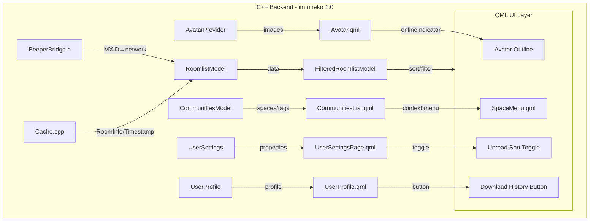
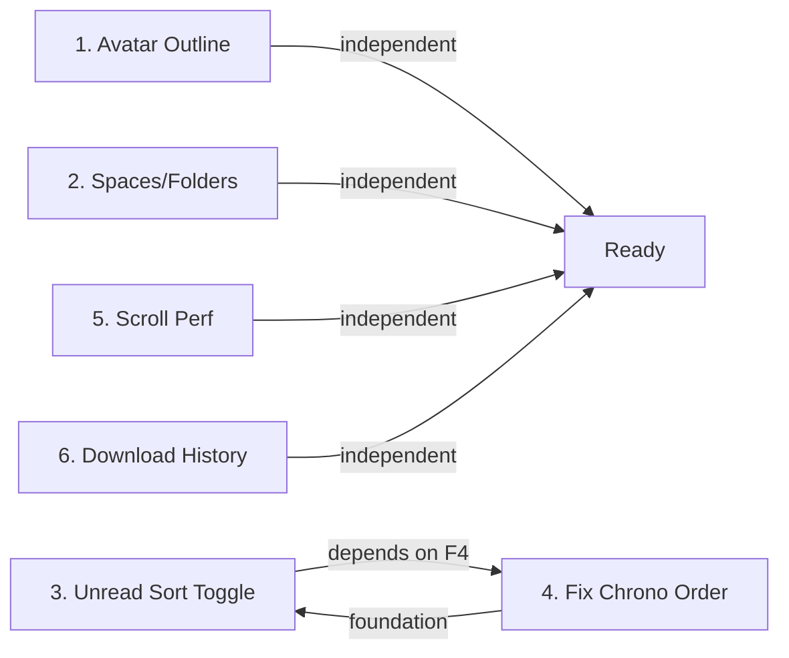

# NhekoBeep Feature Roadmap v3 — Implementation Plan

> **STATUS: 🟡 PLANNING** — Awaiting user review and approval

## Overview

Six features spanning avatar UI, chat organization, sorting, performance, and data export. Each feature is broken into atomic, dependency-ordered steps with exact file paths and implementation details.

---

## Architecture Context



---

## Feature 1: Network Badge → Avatar Outline Coloring

### Goal
Replace the small colored dot (`onlineIndicator`) on avatars with a colored border/outline that reflects the Beeper bridge network (WhatsApp green, Telegram blue, etc.), with a toggle in User Settings.

### Current State
- [`Avatar.qml:80-112`](nheko/resources/qml/Avatar.qml:80) has `onlineIndicator` Rectangle — a small dot at bottom-right showing presence (online/unavailable/offline).
- [`RoomlistModel.cpp:33-75`](nheko/src/timeline/RoomlistModel.cpp:33) has `kBeeperPrefixMap` — maps MXID localpart prefixes to network name + color.
- [`RoomlistModel.h:23-27`](nheko/src/timeline/RoomlistModel.h:23) has `struct BeeperNetworkInfo { QString name; QColor color; }`.
- [`RoomlistModel.h:91-92`](nheko/src/timeline/RoomlistModel.h:91) has roles `BeeperNetworkRole` and `BeeperNetworkColorRole`.
- Network color is already available per-room via `BeeperNetworkColorRole`.

### Implementation Steps

#### Step 1.1: Add `networkOutline` setting to [`UserSettingsPage.h`](nheko/src/UserSettingsPage.h)
- Add `Q_PROPERTY(bool networkOutline READ networkOutline WRITE setNetworkOutline NOTIFY networkOutlineChanged)` (after `avatarCircles`)
- Add `bool networkOutline_` member (default `true`)
- Add getter/setter/signal
- In `UserSettingsModel` enum `Indices`, add `NetworkOutline` entry (after `AvatarCircles`)
- In `UserSettingsModel::data()`, handle the new toggle item
- In `UserSettingsModel::setData()`, handle the toggle

#### Step 1.2: Persist setting in QSettings
- In [`UserSettingsPage.h`](nheko/src/UserSettingsPage.h) `save()`/`load()`:
  - `settings.setValue("network_outline", networkOutline_);`
  - `networkOutline_ = settings.value("network_outline", true).toBool();`

#### Step 1.3: Modify [`Avatar.qml`](nheko/resources/qml/Avatar.qml) to support outline
- Add `property color outlineColor: "transparent"` to the root `AbstractButton`
- Add `property real outlineWidth: 0` 
- Modify the `background: Rectangle` (lines 28-33):
  - Add a `border.color: avatar.outlineColor` 
  - Add `border.width: avatar.outlineWidth`
- Replace the `onlineIndicator` Rectangle (lines 80-112) with outline logic:
  - When `Settings.networkOutline` is `true` AND `avatar.userid` is set:
    - Query the network color via `Presence` or a new QML-exposed model
    - Set `outlineColor` to the network color, `outlineWidth` to 2-3px
  - When `Settings.networkOutline` is `false`:
    - Keep existing `onlineIndicator` dot behavior (or hide it if networkOutline is the only mode)

#### Step 1.4: Expose network color to Avatar QML
- The Avatar component needs access to the Beeper network color for its userid.
- Add a new role or Q_INVOKABLE to look up network color by userid.
- **Approach A**: Add a `Q_INVOKABLE` method to `RoomlistModel`:
  ```cpp
  Q_INVOKABLE QColor networkColorForUser(const QString &userid) const;
  ```
- **Approach B**: Expose via `Presence` singleton (already has `userPresence`).
- **Recommended**: Approach A — add to `RoomlistModel` since it already has `kBeeperPrefixMap`.

#### Step 1.5: Avatar.qml outline binding
```qml
// In Avatar.qml, add:
readonly property bool showNetworkOutline: Settings.networkOutline && avatar.userid !== ""
readonly property color networkColor: showNetworkOutline ? Rooms.networkColorForUser(avatar.userid) : "transparent"

// Update background:
background: Rectangle {
    id: bg
    color: palette.alternateBase
    radius: Settings.avatarCircles ? height / 2 : height / 8
    border.color: avatar.networkColor
    border.width: avatar.showNetworkOutline ? 3 : 0
}
```

### Files Modified
| File | Change |
|------|--------|
| [`nheko/src/UserSettingsPage.h`](nheko/src/UserSettingsPage.h) | Add `networkOutline` property, member, getter/setter/signal |
| [`nheko/src/UserSettingsPage.cpp`](nheko/src/UserSettingsPage.cpp) | Persist in QSettings, add to UserSettingsModel |
| [`nheko/src/timeline/RoomlistModel.h`](nheko/src/timeline/RoomlistModel.h) | Add `Q_INVOKABLE networkColorForUser(QString)` |
| [`nheko/src/timeline/RoomlistModel.cpp`](nheko/src/timeline/RoomlistModel.cpp) | Implement `networkColorForUser()` using `kBeeperPrefixMap` on the counterpart MXID |
| [`nheko/resources/qml/Avatar.qml`](nheko/resources/qml/Avatar.qml) | Add outline properties, modify background border, conditionally show outline vs dot |
| [`nheko/resources/qml/pages/UserSettingsPage.qml`](nheko/resources/qml/pages/UserSettingsPage.qml) | Add NetworkOutline toggle row in General section |

---

## Feature 2: Spaces / Chat Folders

### Goal
Allow users to create "Spaces" (folders) and assign chats to them. Spaces appear in the left sidebar like folders. Right-click on a space to modify its icon and assign/remove chats.

### Current State
- [`CommunitiesModel`](nheko/src/timeline/CommunitiesModel.h) manages the community/sidebar tree with `FlatTree` structure.
- [`CommunitiesList.qml`](nheko/resources/qml/CommunitiesList.qml) renders sidebar items.
- [`SpaceMenu.qml`](nheko/resources/qml/components/SpaceMenu.qml) and [`SpaceMenuLevel.qml`](nheko/resources/qml/components/SpaceMenuLevel.qml) provide right-click context menus for assigning rooms to Matrix spaces.
- Tags (`m.favourite`, `m.lowpriority`, user tags) are already supported via `CustomLabelListModel` in [`UserSettingsPage.h:662-706`](nheko/src/UserSettingsPage.h:662).
- The `CustomLabel` struct has `tag`, `displayName`, `iconKey`.

### Implementation Steps

#### Step 2.1: Extend `CustomLabel` to support folder/spaces semantics
- Add `isFolder` flag to [`CustomLabel`](nheko/src/UserSettingsPage.h:15-26):
  ```cpp
  struct CustomLabel {
      Q_GADGET
      Q_PROPERTY(QString tag MEMBER tag CONSTANT)
      Q_PROPERTY(QString displayName MEMBER displayName CONSTANT)
      Q_PROPERTY(QString iconKey MEMBER iconKey CONSTANT)
      Q_PROPERTY(bool isFolder MEMBER isFolder CONSTANT)
  public:
      QString tag;
      QString displayName;
      QString iconKey;
      bool isFolder = false;
  };
  ```

#### Step 2.2: Add "Create Space/Folder" UI
- In [`CommunitiesList.qml`](nheko/resources/qml/CommunitiesList.qml), add a "+" button at the bottom of the sidebar list.
- Clicking opens a dialog to:
  - Name the space/folder
  - Choose an icon (from a predefined list or emoji)
- This calls `CustomLabelListModel.addLabel(tag, displayName, iconKey)` with `isFolder=true`.
- The tag format: `u.folder.{name}` (prefixed with `u.` for user tags).

#### Step 2.3: Right-click context menu on space items
- Extend the existing `communityContextMenu` in [`CommunitiesList.qml:198-233`](nheko/resources/qml/CommunitiesList.qml:198):
  - Add "Change Icon..." menu item → opens icon picker dialog
  - Add "Rename..." menu item → opens rename dialog
  - Add "Delete Space" menu item → removes the custom label (does NOT leave rooms)
  - These call `CustomLabelListModel.updateLabel()` / `removeLabel()`.

#### Step 2.4: Assign chats to spaces
- Right-click on a room in [`RoomList.qml`](nheko/resources/qml/RoomList.qml) → existing context menu
- Add "Assign to Space..." submenu that lists all user-created spaces/folders
- Selecting a space calls `FilteredRoomlistModel.toggleTag(roomid, "u.folder.{name}", true)`
- To remove from space, uncheck the same item

#### Step 2.5: Update `CommunitiesModel` to show user folders
- In [`CommunitiesModel.cpp`](nheko/src/timeline/CommunitiesModel.cpp), the `Categories` enum already has `UserTag` (line 718).
- Ensure user folders appear in the sidebar tree with their custom icon.
- Update the `data()` function to return the custom icon for user tag entries.
- Folders should be collapsible (like spaces already are).

#### Step 2.6: Icon picker component
- Create a simple icon picker (or reuse existing emoji/sticker infrastructure):
  - Predefined icon set (folder, work, home, game, star, heart, etc.)
  - OR allow emoji as icon (simpler)
- Store icon choice as `iconKey` in `CustomLabel`.

### Files Modified
| File | Change |
|------|--------|
| [`nheko/src/UserSettingsPage.h`](nheko/src/UserSettingsPage.h) | Add `isFolder` to `CustomLabel`, extend `CustomLabelListModel` |
| [`nheko/src/UserSettingsPage.cpp`](nheko/src/UserSettingsPage.cpp) | Implement new methods, persist `isFolder` in QSettings |
| [`nheko/src/timeline/CommunitiesModel.cpp`](nheko/src/timeline/CommunitiesModel.cpp) | Show user folders in sidebar with icons |
| [`nheko/resources/qml/CommunitiesList.qml`](nheko/resources/qml/CommunitiesList.qml) | Add "+" button, extend context menu, icon display |
| [`nheko/resources/qml/RoomList.qml`](nheko/resources/qml/RoomList.qml) | Add "Assign to Space" submenu in room context menu |

---

## Feature 3: Unread-First Sort Toggle

### Goal
Add a toggle (where the logout button currently is, or near it) that, when enabled, sorts rooms with unread messages to the top. When disabled, uses default chronological sorting.

### Current State
- Logout button at [`RoomList.qml:230-243`](nheko/resources/qml/RoomList.qml:230) — `ImageButton id: logoutButton` with power-off icon.
- [`UserSettingsPage.h:53-56`](nheko/src/UserSettingsPage.h:53) already has `sortByImportance` and `sortByAlphabet`.
- The `calculateImportance()` function (line 1010) already handles notification-based sorting.
- The user wants: a toggle that specifically sorts **unread** (not just notified) rooms first.

### Implementation Steps

#### Step 3.1: Add `sortUnreadFirst` setting to [`UserSettingsPage.h`](nheko/src/UserSettingsPage.h)
- Add `Q_PROPERTY(bool sortUnreadFirst READ sortUnreadFirst WRITE setSortUnreadFirst NOTIFY sortUnreadFirstChanged)`
- Add `bool sortUnreadFirst_` member (default `false`)
- Add getter/setter/signal

#### Step 3.2: Modify `calculateImportance()` in [`RoomlistModel.cpp`](nheko/src/timeline/RoomlistModel.cpp:1010)
- After the `ImportanceDisabled` check, add a new check:
  ```cpp
  } else if (this->sortUnreadFirst && 
             sourceModel()->data(idx, RoomlistModel::HasUnreadMessages).toBool()) {
      return UnreadFirst;  // new enum value, priority between NewMessage and AllEventsRead
  }
  ```
- Add `UnreadFirst` to the importance enum (value between `NewMessage` and `AllEventsRead`).

#### Step 3.3: Add toggle UI in [`RoomList.qml`](nheko/resources/qml/RoomList.qml)
- **Option A**: Replace the logout button with the unread sort toggle, move logout elsewhere.
- **Option B**: Add the toggle next to/below the logout button area.
- **Recommended**: Option B — add a small toggle switch below the logout button in the user info header area (lines 230-243).
  ```qml
  // After logoutButton, inside the userInfoGrid RowLayout:
  ImageButton {
      id: unreadSortToggle
      Layout.alignment: Qt.AlignVCenter
      Layout.preferredHeight: fontMetrics.lineSpacing * 1.5
      Layout.preferredWidth: fontMetrics.lineSpacing * 1.5
      ToolTip.text: Settings.sortUnreadFirst ? qsTr("Unread sort: ON") : qsTr("Unread sort: OFF")
      ToolTip.visible: hovered
      image: Settings.sortUnreadFirst ? ":/icons/icons/ui/sort-unread-on.svg" : ":/icons/icons/ui/sort-unread-off.svg"
      visible: !collapsed
      onClicked: Settings.sortUnreadFirst = !Settings.sortUnreadFirst
  }
  ```
- Need to create or find appropriate SVG icons for sort-unread-on / sort-unread-off.

#### Step 3.4: Connect setting change to model re-sort
- In [`FilteredRoomlistModel`](nheko/src/timeline/RoomlistModel.cpp:1077) constructor:
  ```cpp
  QObject::connect(UserSettings::instance().get(),
                   &UserSettings::sortUnreadFirstChanged,
                   this,
                   [this](bool sortUnreadFirst_) {
                       this->sortUnreadFirst = sortUnreadFirst_;
                       invalidate();
                   });
  ```

### Files Modified
| File | Change |
|------|--------|
| [`nheko/src/UserSettingsPage.h`](nheko/src/UserSettingsPage.h) | Add `sortUnreadFirst` property |
| [`nheko/src/UserSettingsPage.cpp`](nheko/src/UserSettingsPage.cpp) | Persist in QSettings |
| [`nheko/src/timeline/RoomlistModel.h`](nheko/src/timeline/RoomlistModel.h) | Add `sortUnreadFirst` member to `FilteredRoomlistModel` |
| [`nheko/src/timeline/RoomlistModel.cpp`](nheko/src/timeline/RoomlistModel.cpp) | Modify `calculateImportance()`, connect signal |
| [`nheko/resources/qml/RoomList.qml`](nheko/resources/qml/RoomList.qml) | Add toggle button in user info header |

---

## Feature 4: Fix Chronological Ordering

### Root Cause Analysis
The `RoomlistModel::data()` returns `Timestamp` from `room->lastMessageTimestamp()` (line 220). This timestamp is updated on **any** room event — including state events like avatar changes, name changes, topic changes. This means non-message events push rooms to the top incorrectly.

The `lessThan()` function (line 1040) sorts by `Timestamp` for rooms with the same importance level, so state events incorrectly reorder the room list.

### Implementation Steps

#### Step 4.1: Identify where `lastMessageTimestamp` is set
- Search [`TimelineModel.cpp`](nheko/src/timeline/TimelineModel.cpp) and [`Cache.cpp`](nheko/src/Cache.cpp) for where `lastMessageTimestamp` / `approximate_last_modification_ts` is updated.
- Key locations to check:
  - `Cache::saveTimelineMessages()` — should only update on actual message events
  - `TimelineModel::handleSync()` or similar sync handler
  - `RoomInfo::approximate_last_modification_ts` in [`CacheStructs.h:70-100`](nheko/src/CacheStructs.h:70)

#### Step 4.2: Filter out state events from timestamp updates
- In the sync handler and event processing code, before updating the timestamp, check the event type:
  ```cpp
  // Only update timestamp for message-like events, not state events
  bool isMessageEvent = std::holds_alternative<mtx::events::RoomEvent<mtx::events::msg::...>>(event);
  // Or check: not a state event, not a member event
  ```
- Specifically exclude:
  - `m.room.avatar` (avatar changes)
  - `m.room.name` (name changes)
  - `m.room.topic` (topic changes)
  - `m.room.member` (join/leave events, unless they're the user's own)
  - `m.room.create`, `m.room.canonical_alias`, etc.

#### Step 4.3: Use event origin_server_ts instead of reception time
- Matrix events have `origin_server_ts` (when the event was originally sent).
- Ensure `lastMessageTimestamp` uses `origin_server_ts` rather than local reception time for consistent ordering across devices.

#### Step 4.4: Add a separate "last activity" timestamp for state events
- If needed for UI (e.g., showing "avatar changed" in last message preview), keep a separate `lastActivityTimestamp` but use `lastMessageTimestamp` for sorting.

### Files Modified
| File | Change |
|------|--------|
| [`nheko/src/timeline/TimelineModel.cpp`](nheko/src/timeline/TimelineModel.cpp) | Filter event types before updating timestamp |
| [`nheko/src/Cache.cpp`](nheko/src/Cache.cpp) | Filter event types in saveTimelineMessages or equivalent |
| [`nheko/src/CacheStructs.h`](nheko/src/CacheStructs.h) | Optionally add `lastMessageTimestamp` separate from `approximate_last_modification_ts` |

---

## Feature 5: Scroll Performance / Avatar Loading

### Goal
Fix slow avatar loading during scroll. Address the root causes identified in the existing [`scroll-performance-optimization.md`](plans/scroll-performance-optimization.md) plan.

### Current State
- [`plans/scroll-performance-optimization.md`](plans/scroll-performance-optimization.md) already documents the issues and proposed fixes.
- Issues: `reuseItems: true` commented out, PNG cache format, small QPixmapCache, no pre-fetching.

### Implementation Steps

#### Step 5.1: Enable `reuseItems: true` in RoomList.qml
- In [`RoomList.qml`](nheko/resources/qml/RoomList.qml), find the ListView and uncomment/enable `reuseItems: true`.
- This prevents QML from destroying/recreating delegates on scroll, eliminating redundant avatar loads.

#### Step 5.2: Switch disk cache from PNG to WebP
- In [`MxcImageProvider.cpp`](nheko/src/MxcImageProvider.cpp), find the thumbnail save code (~line 282).
- Change format from `"PNG"` to `"WEBP"` with quality 85:
  ```cpp
  img.save(cachePath, "WEBP", 85);
  ```
- WebP is 2-5× smaller for photo-like content (avatars).

#### Step 5.3: Increase QPixmapCache limit
- In [`main.cpp`](nheko/src/main.cpp), add after `QApplication` creation:
  ```cpp
  QPixmapCache::setCacheLimit(51200); // 50 MB (default is ~10 MB)
  ```

#### Step 5.4: Add cache for `effectivePixelSize` in Avatar.qml
- Already partially done — [`Avatar.qml:23`](nheko/resources/qml/Avatar.qml:23) has `effectivePixelSize`.
- Ensure `sourceSize` (lines 74-75) uses this cached value to avoid recalculations.

#### Step 5.5: Pre-fetch avatars for visible + near-visible rooms
- In [`RoomList.qml`](nheko/resources/qml/RoomList.qml), use the ListView's `contentY` and `visibleArea` to determine which items are about to become visible.
- Trigger avatar pre-load for items just outside the viewport.
- This can use `AvatarProvider::prewarm(url, size)` or similar.

#### Step 5.6: Add cross-fade transition in Avatar.qml
- Already partially implemented — the `Behavior on opacity` at lines 48, 57, 78 provide fade transitions.
- Ensure the transition from identicon/letter → real image is smooth.

### Files Modified
| File | Change |
|------|--------|
| [`nheko/resources/qml/RoomList.qml`](nheko/resources/qml/RoomList.qml) | Enable `reuseItems: true`, add pre-fetch logic |
| [`nheko/src/MxcImageProvider.cpp`](nheko/src/MxcImageProvider.cpp) | PNG → WebP for disk cache |
| [`nheko/src/main.cpp`](nheko/src/main.cpp) | Increase QPixmapCache limit to 50 MB |
| [`nheko/src/AvatarProvider.cpp`](nheko/src/AvatarProvider.cpp) | Size-aware cache, prewarm API |
| [`nheko/resources/qml/Avatar.qml`](nheko/resources/qml/Avatar.qml) | Optimize sourceSize, verify cross-fade |

---

## Feature 6: Download Full Chat History Button

### Goal
Add a button in the user profile dialog that downloads the **complete** chat history with that contact (all messages across all rooms/DMs) and saves it to a file.

### Current State
- [`UserProfile.qml`](nheko/resources/qml/dialogs/UserProfile.qml) at lines 261-318 has a RowLayout of action buttons (start chat, kick, ban, ignore, refresh).
- [`UserProfile.h`](nheko/src/ui/UserProfile.h) has `Q_INVOKABLE` methods like `startChat()`, `banUser()`, `kickUser()`.
- [`Cache.cpp`](nheko/src/Cache.cpp) has methods to query timeline messages per room.
- Matrix API: `GET /_matrix/client/v3/rooms/{roomId}/messages` supports pagination via `from` token.

### Implementation Steps

#### Step 6.1: Add `Q_INVOKABLE downloadChatHistory()` to [`UserProfile.h`](nheko/src/ui/UserProfile.h)
```cpp
Q_INVOKABLE void downloadChatHistory();
```
- This method will:
  1. Find all direct/group rooms shared with this user.
  2. For each room, paginate through all messages using the Matrix `/messages` API.
  3. Decrypt messages where possible.
  4. Format as a text/HTML/JSON file.
  5. Save via `QFileDialog::getSaveFileName()`.

#### Step 6.2: Implement the download logic in [`UserProfile.cpp`](nheko/src/ui/UserProfile.cpp)
```cpp
void UserProfile::downloadChatHistory()
{
    // 1. Get all rooms shared with this user
    auto sharedRooms = cache::getRoomsWithUser(userid_.toStdString());
    
    // 2. For each room, fetch all messages
    // Use recursive pagination: GET /messages, if there's a 'from' token, fetch more
    // Collect all into a structured format
    
    // 3. Show save dialog
    QString filePath = QFileDialog::getSaveFileName(nullptr, "Save Chat History", 
        userid_ + "_history.txt", "Text Files (*.txt);;JSON Files (*.json)");
    
    // 4. Write to file
}
```

#### Step 6.3: Add pagination helper
Create a recursive/iterative pagination function:
```cpp
void fetchAllMessages(const std::string &roomId, 
                      const std::string &fromToken,
                      std::vector<mtx::events::collections::TimelineEvents> &accumulated,
                      std::function<void()> onComplete)
{
    mtx::http::MessagesOpts opts;
    opts.room_id = roomId;
    opts.from = fromToken;
    opts.dir = mtx::http::PaginationDirection::Backward;
    opts.limit = 100;
    
    http::client()->messages(opts, [&](const mtx::responses::Messages &res, 
                                        mtx::http::RequestErr err) {
        if (err) { onComplete(); return; }
        
        accumulated.insert(accumulated.end(), res.chunk.begin(), res.chunk.end());
        
        if (!res.end.empty() && res.end != fromToken) {
            fetchAllMessages(roomId, res.end, accumulated, onComplete);
        } else {
            onComplete();
        }
    });
}
```

#### Step 6.4: Format output
Format each message as:
```
[YYYY-MM-DD HH:MM:SS] DisplayName (MXID): Message text
```
For encrypted messages, decrypt using the Olm session store before formatting.

#### Step 6.5: Add progress indicator
- Emit signals for progress: `historyDownloadProgress(int current, int total)`.
- Show a progress bar in the UserProfile dialog during download.
- Allow cancellation.

#### Step 6.6: Add UI button in [`UserProfile.qml`](nheko/resources/qml/dialogs/UserProfile.qml)
- Add after the "Refresh device list" button (line 309-317):
```qml
ImageButton {
    Layout.preferredHeight: 24
    Layout.preferredWidth: 24
    image: ":/icons/icons/ui/download.svg"
    hoverEnabled: true
    ToolTip.visible: hovered
    ToolTip.text: qsTr("Download full chat history.")
    onClicked: profile.downloadChatHistory()
}
```

### Files Modified
| File | Change |
|------|--------|
| [`nheko/src/ui/UserProfile.h`](nheko/src/ui/UserProfile.h) | Add `Q_INVOKABLE downloadChatHistory()`, progress signals |
| [`nheko/src/ui/UserProfile.cpp`](nheko/src/ui/UserProfile.cpp) | Implement pagination, formatting, file save logic |
| [`nheko/resources/qml/dialogs/UserProfile.qml`](nheko/resources/qml/dialogs/UserProfile.qml) | Add download button with progress dialog |

---

## Implementation Order & Dependencies



- **Feature 4 should be done before Feature 3** because the unread sort toggle relies on correct chronological ordering as its baseline.
- Features 1, 2, 5, and 6 are independent of each other and can be implemented in any order.
- Feature 5 (scroll performance) already has a detailed plan in [`plans/scroll-performance-optimization.md`](plans/scroll-performance-optimization.md).

## Summary of All Files Touched

| File | Features |
|------|----------|
| [`nheko/src/UserSettingsPage.h`](nheko/src/UserSettingsPage.h) | F1, F2, F3 |
| [`nheko/src/UserSettingsPage.cpp`](nheko/src/UserSettingsPage.cpp) | F1, F2, F3 |
| [`nheko/src/timeline/RoomlistModel.h`](nheko/src/timeline/RoomlistModel.h) | F1, F3, F4 |
| [`nheko/src/timeline/RoomlistModel.cpp`](nheko/src/timeline/RoomlistModel.cpp) | F1, F3, F4 |
| [`nheko/src/timeline/CommunitiesModel.h`](nheko/src/timeline/CommunitiesModel.h) | F2 |
| [`nheko/src/timeline/CommunitiesModel.cpp`](nheko/src/timeline/CommunitiesModel.cpp) | F2 |
| [`nheko/src/timeline/TimelineModel.cpp`](nheko/src/timeline/TimelineModel.cpp) | F4 |
| [`nheko/src/Cache.cpp`](nheko/src/Cache.cpp) | F4 |
| [`nheko/src/CacheStructs.h`](nheko/src/CacheStructs.h) | F4 |
| [`nheko/src/ui/UserProfile.h`](nheko/src/ui/UserProfile.h) | F6 |
| [`nheko/src/ui/UserProfile.cpp`](nheko/src/ui/UserProfile.cpp) | F6 |
| [`nheko/src/MxcImageProvider.cpp`](nheko/src/MxcImageProvider.cpp) | F5 |
| [`nheko/src/main.cpp`](nheko/src/main.cpp) | F5 |
| [`nheko/src/AvatarProvider.cpp`](nheko/src/AvatarProvider.cpp) | F5 |
| [`nheko/resources/qml/Avatar.qml`](nheko/resources/qml/Avatar.qml) | F1, F5 |
| [`nheko/resources/qml/RoomList.qml`](nheko/resources/qml/RoomList.qml) | F2, F3, F5 |
| [`nheko/resources/qml/CommunitiesList.qml`](nheko/resources/qml/CommunitiesList.qml) | F2 |
| [`nheko/resources/qml/dialogs/UserProfile.qml`](nheko/resources/qml/dialogs/UserProfile.qml) | F6 |
| [`nheko/resources/qml/pages/UserSettingsPage.qml`](nheko/resources/qml/pages/UserSettingsPage.qml) | F1 |
